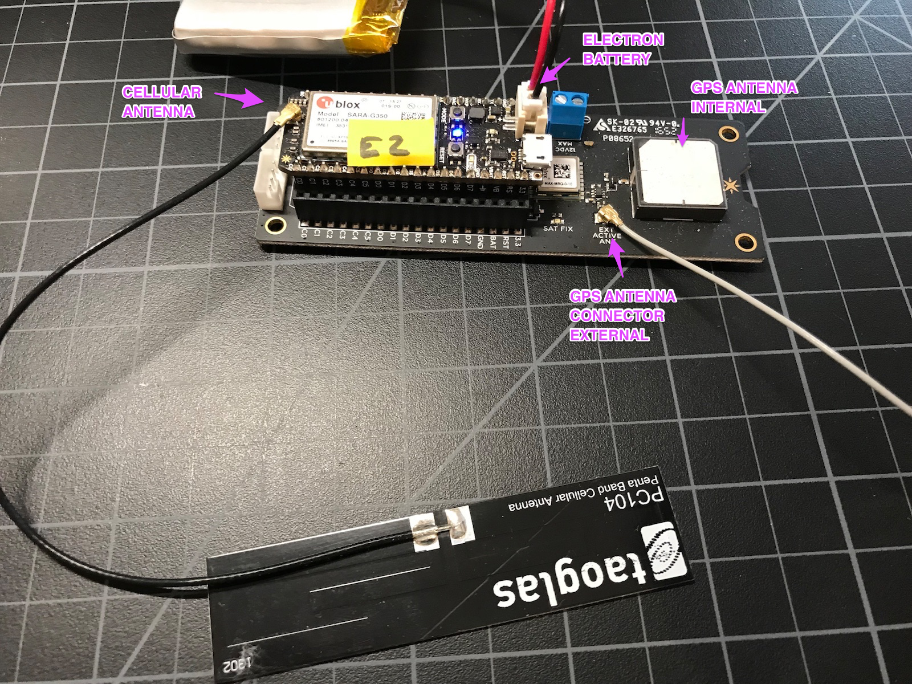

# AssetTracker Troubleshooting

If you are having trouble getting a fix from your Particle AssetTracker board, this troubleshooting tool may help. It's uses a pre-built version of the 7_DataDump example from the [AssetTrackerRK](https://github.com/rickkas7/AssetTrackerRK) library.



## Install the Particle CLI

If you have not already done so, install the [Particle CLI](https://www.particle.io/products/development-tools/particle-command-line-interface). It includes the command line utility needed to install this firmware.

## Download the binary

Download the [gpsdump.bin](https://github.com/rickkas7/particle_notes/raw/master/asset-tracker-troubleshooting/gpsdump.bin) file in most cases. This uses the internal antenna on the AssetTracker v2 board.

If you are using an external antenna, use [gpsdump_ext.bin](https://github.com/rickkas7/particle_notes/raw/master/asset-tracker-troubleshooting/gpsdump_ext.bin), which is configured to use an external active GPS antenna connected to the AssetTracker u.FL GPS antenna connector.

## Flash the binary

- Connect the Electron by USB to your computer. 

- Put the Electron in [DFU mode](https://docs.particle.io/guide/getting-started/modes/electron/#dfu-mode-device-firmware-upgrade-) (blinking yellow) by holding down RESET and MODE, releasing RESET and continuing to hold down MODE while the main LED blinks magenta until it blinks yellow, then release.

- Open a Command Prompt or Terminal window. 

- Run the commands, typically:

```
cd Downloads
particle flash --usb gpsdump.bin
```

If you've downloaded the binary to a different location, substitute that directory in the cd Downloads command, of course.

And if you're using an external antenna:

```
particle flash --usb gpsdump_ext.bin
```

The Electron should breathe white after installation.


## Monitor the USB serial port

Then monitor the USB serial port. The easiest way is usually:

```
particle serial monitor
```

## Electron doesn't breathe white

If Electron blinks green, cyan, then breathes magenta, or gets stuck at blinking green, your Electron needs to be updated to system firmware 0.5.3 or later.


- Put the Electron in [DFU mode](https://docs.particle.io/guide/getting-started/modes/electron/#dfu-mode-device-firmware-upgrade-) (blinking yellow) by holding down RESET and MODE, releasing RESET and continuing to hold down MODE while the main LED blinks magenta until it blinks yellow, then release.

- Run the command:

```
particle update
```


