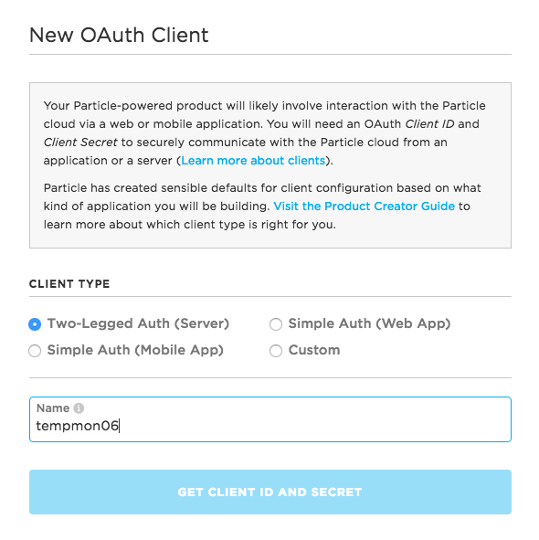
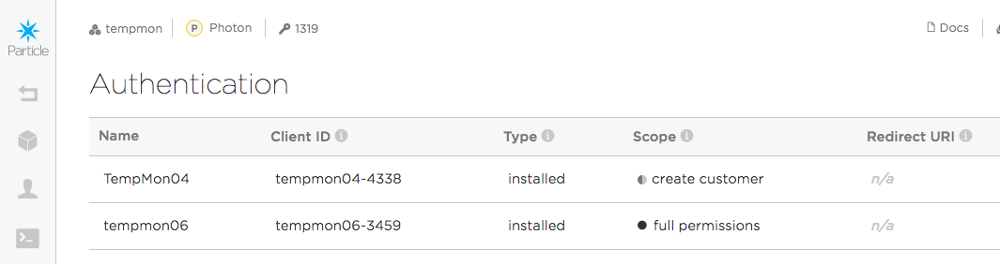

# Authenticating Particle product APIs

*Quick introduction to authenticating Particle product APIs*

## User token

When you use normal, non-product APIs, you use a user token. One way to get your user token is to use the [Particle CLI](https://docs.particle.io/reference/developer-tools/cli/#particle-token-create) command `particle token create`.

Remember to keep your access token secret; they allow access to your account to anyone who has the token! 

(All of the tokens in this document are fake, by the way.)

You would use this for a command like this, to [list your devices](https://docs.particle.io/reference/api/#list-devices):

```
curl https://api.particle.io/v1/devices?access_token=ab142050967cff79dc6586c82193978b3a62cab9
```

One thing that can be confusing is that this token is only good for your user account, not your product, so this won't work for any of the product APIs.

## Creating an OAuth client

In order to use the product APIs, you need a product access token. Creating one is a two-step process. The first part is to create an OAuth client.

- Open your product in the [console](https://console.particle.io)
- Open the **Authentication** tab.
- Click **New Client**.



You will want to create **Two-legged Auth (Server)** client. In the next screen, you will get a token. Copy and paste this as you can't get it back again. It's also important to keep this a secret. And, it's not your product access token.



In the next steps you'll need a few things:

- The **Name** field matches the name we just created above (tempmon06)
- The **Client ID** field will be needed to make API calls (tempmon06-3459)
- The secret client token we got when creating a new client. In the examples below, `460edfd8d70742dd1f1e75c3d5cac5973351465d` is the token we got.

## Create a product bearer token

In order to use the APIs you need a product bearer token. Here's a command in curl to create one:

```
curl https://api.particle.io/oauth/token -u "tempmon06-3459:460edfd8d70742dd1f1e75c3d5cac5973351465d" -d grant_type=client_credentials 
```

Note that the username and password passed in the -u option are the client ID created above and the access token for that client. 

That call will return something like this:

```
{
  "token_type": "bearer",
  "access_token": "5724113917ac1e1cbf80cae2e24dd27c56245bdb",
  "expires_in": 7776000,
  "refresh_token": "7ff08565378780581aa27eeb4eb92a4e4dbcc3a5"
}
```

That access_token is the one you need!

The reason for all of this is that the client token needs to be kept safe because it has the ability to create new tokens. The bearer token you use to authenticate individual requests has a shorter life and is more "disposable" in case it gets into the wrong hands.

## Product ID or Slug

All of the product APIs include `:productIdOrSlug` in the URL.

Your product ID is a number, located next to the key on the top of your product window. It's 1319 in the screenshot below.

You can also use the string in the URL. In this example, its **tempmon-v100**.


Armed with these two things, you can now make product API calls!

Get information about your product:

```
curl https://api.particle.io/v1/products/1319?access_token=5724113917ac1e1cbf80cae2e24dd27c56245bdb
```

Or using the slug:

```
curl https://api.particle.io/v1/products/tempmon-v100?access_token=5724113917ac1e1cbf80cae2e24dd27c56245bdb
```

Get a [list of product devices](https://docs.particle.io/reference/api/#list-devices-in-a-product):

```
curl https://api.particle.io/v1/products/1319/devices?access_token=5724113917ac1e1cbf80cae2e24dd27c56245bdb
```

And so on, for all of the product APIs.


