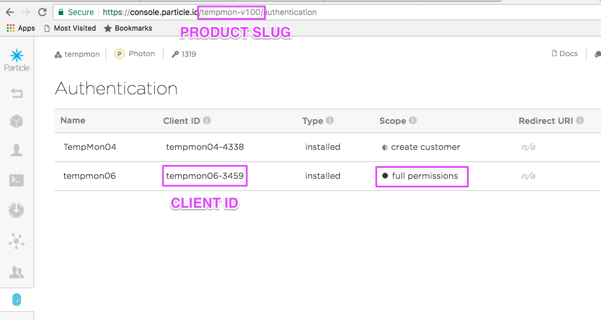

# Creating a product webhook

The [Particle CLI](https://docs.particle.io/guide/tools-and-features/cli) is my preferred way to create webhooks because I prefer editing a JSON file over using the web-based UI in the [console](https://console.particle.io). 

By the way, if you're used to using the web-based UI, my [webhook tutorial](https://github.com/rickkas7/particle-webhooks) includes information on how to map from the fields in the web user interface to the JSON configuration.

But one major problem is that the particle CLI does not allow you to create product webhooks. This will be fixed at some point in the future, but for now, here's a workaround. 

**This was a very quickly implemented workaround. It may have bugs.**

You'll need to have curl installed to use this technique. It's usually built-in for Mac and Linux, but for Windows you'll [need to install it](https://docs.particle.io/faq/particle-tools/installing-curl/).

## Authentication

One issue when working with products is that you can't use a standard authentication token, like the one copied out of [Particle build](https://build.particle.io). 

At [console.particle.io](https://console.particle.io) select your product, then the Authentication icon (fingerprint). Create a new OAuth client, two-legged (server) with no restrictions (full permissions). Save the client ID and secret. Make sure you keep the secret secret. Also, this is not an authentication token.



```
curl https://api.particle.io/oauth/token -u "tempmon06-3459:460edfd8d70742dd1f1e75c3d5cac5973351465d" -d grant_type=client_credentials 
```

Note that:

- tempmon06-3459 is what's in the ClientID column in the list of authentications.
- 460edfd8d70742dd1f1e75c3d5cac5973351465d is your secret key.

A successful response to that includes the access token in the access_token parameter. For example:

```
{
  "token_type": "bearer",
  "access_token": "5724113917ac1e1cbf80cae2e24dd27c56245bdb",
  "expires_in": 7776000,
  "refresh_token": "7ff08565378780581aa27eeb4eb92a4e4dbcc3a5"
}
```

You can test it out using a command like:

```
curl https://api.particle.io/v1/products/tempmon-v100?access_token=5724113917ac1e1cbf80cae2e24dd27c56245bdb
```

Where:

- tempmon-v100 is your product slug. It's what shows up in the URL bar when you're viewing your product.
- 5724113917ac1e1cbf80cae2e24dd27c56245bdb is replaced by your access token you just created

Or, get an actual list of your product webhooks:

```
curl https://api.particle.io/v1/products/tempmon-v100/webhooks?access_token=5724113917ac1e1cbf80cae2e24dd27c56245bdb
```

## Creating a webhook

As it turns out, while the API for creating a webhook is simple, it requires converting the hook JSON file into form URL encoded, which is not a feature built into curl. 

To get around this, I wrote a very short node.js script to do it. 

**I wrote this very quickly. There may be bugs.**

### Initial setup

- Download the [prodhook.js](https://raw.githubusercontent.com/rickkas7/particle_notes/master/create-product-webhook/prodhook.js) file into a directory.

- From the command line, in the directory with prodhook.js, install its dependencies:

```
npm install yargs request
```

### Update the accessToken

You can either modify prodhook.js and paste in your access token retrieved above, or you can pass it on the command line. 

- Editing prodhook.js:

```
// You can paste your access token here for convenience, or use the --accessToken=xxxxx option 
var accessToken = '5724113917ac1e1cbf80cae2e24dd27c56245bdb';

// And your productSlug, or use the --productSlug=xxx option
var productSlug = 'tempmon-v100';
```

- Command Line:

```
node prodhook.js list --accessToken=5724113917ac1e1cbf80cae2e24dd27c56245bdb --productSlug=tempmon-v100
```

### Listing webhooks

To list the product webhooks, use the command:

```
node prodhook.js list
```

Or:

```
node prodhook.js list --accessToken=5724113917ac1e1cbf80cae2e24dd27c56245bdb --productSlug=tempmon-v100
```

### Creating webhooks

To create a product webhook, create a hook JSON file, and use a command like:

```
node prodhook.js create hook2.json 
```

Or:

```
node prodhook.js create hook2.json --accessToken=5724113917ac1e1cbf80cae2e24dd27c56245bdb --productSlug=tempmon-v100
```


### Deleting webhooks

To delete a webhook, use the ID you got from list or create.

```
node prodhook.js delete 5877a29f6bde6c72077c23ef
```

Or:

```
node prodhook.js delete 5877a29f6bde6c72077c23ef --accessToken=5724113917ac1e1cbf80cae2e24dd27c56245bdb --productSlug=tempmon-v100
```

