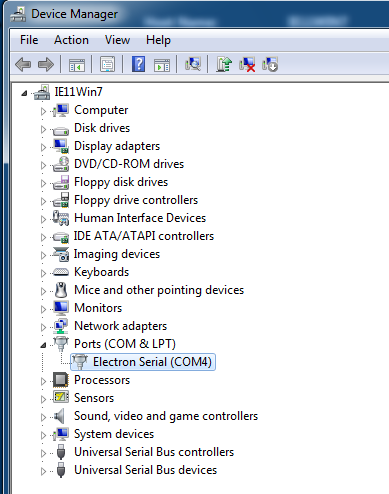
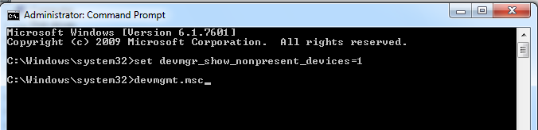
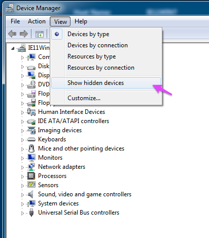
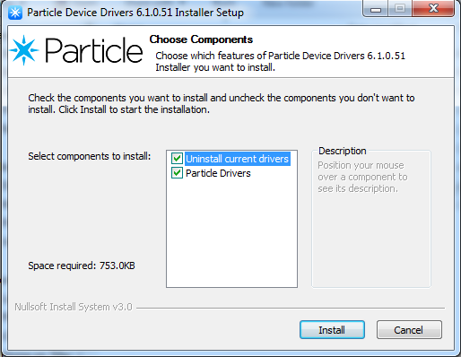
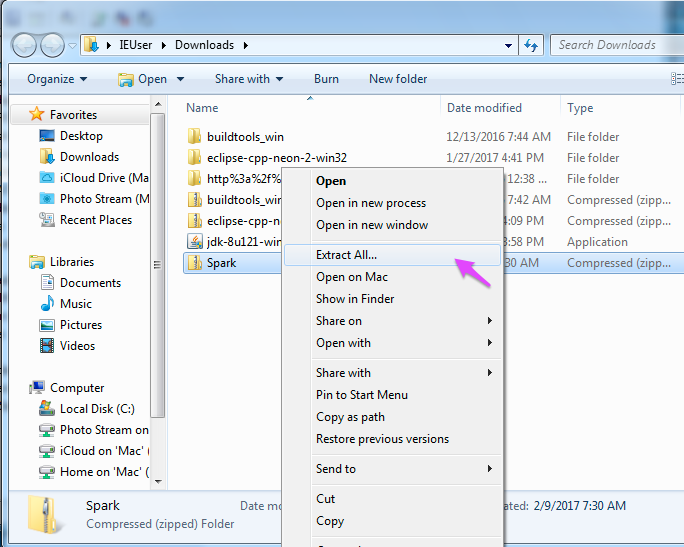
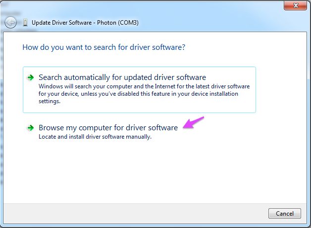
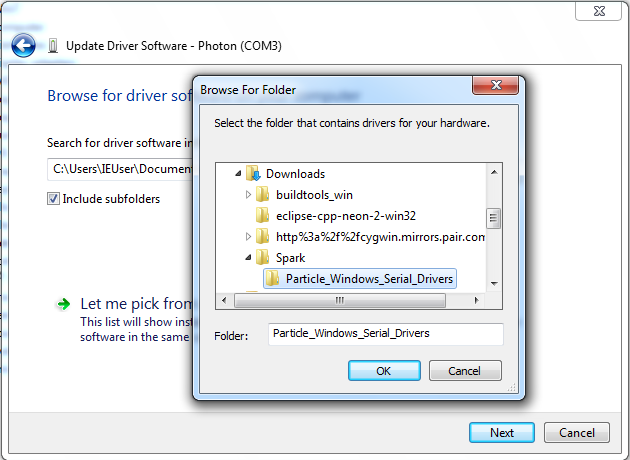

# Debugging Windows 7 Driver Issues

This guide has some tips for debugging driver issues with Windows 7. There will be a separate guide for Windows 10, which is different enough that it warrants a separate guide.

## Getting started

One common bit of confusion is that there are two different drivers used, one for normal operating mode with serial enabled and listening mode (blinking dark blue) that maps to a COM port, and a separate set of drivers for use in DFU mode (blinking yellow). It is possible for one set of drivers to work and not the other.

### Windows Device Manager

You'll be using the Windows Device Manager for several steps. From the **Start** menu, select **Control Panel**. The default is **View by: Category** so select **Hardware and Sound** then select **Device Manager**.


## Serial drivers

Ideally, when you plug in the Photon it will install its device driver, and then you'll see something like **Photon (COM3)** in the **Ports (COM & LPT)** section.


If you right click on the **Photon** item and select **Properties** then click on the **Driver** tab, it should look like this:


If you have an Electron, it might show up as something like **Electron Serial (COM4)**. The driver settings should be these same as the Photon.




### Removing old drivers

Once in a while you'll get stuck with a hidden old driver, and the solution is to remove all of them.

- Unplug all Particle Photon/P1/Electron/Core devices.
- Right click on **Command Prompt** and select **Run as Administrator**.
- Enter the commands:

```
set devmgr_show_nonpresent_devices=1
devmgmt.msc
```



- Open the Device Manager. Select **Show hidden devices** from the **View menu**.



- Now the Photon or Electron should appear in the **Ports (COM & LPT)** section. The COM port number may be different, and there may be more than one.


- Select the Photon or Electron item and hit the **Delete** key, or right-click and select **Uninstall**. The item will disappear. Repeat for all of the Photon or Electron items.

- Close the Device Manager and then plug the Photon or Electron back in and it should automatically reinstall the drivers, hopefully correctly.

For more information on this technique, see [this post](https://community.particle.io/t/windows7-photon-driver-installation-access-is-denied-solved/25799/6).

### Manually installing serial drivers (0.6.0 and later)

If your Photon/P1/Electron/Core is running system firmware 0.6.0 or later, the serial driver situation can be a little easier. Instead of manually uninstalling and reinstalling the drivers, you can simply run the [Particle driver installer](https://github.com/spark/windows-device-drivers/releases/download/v6.1.0.51/particle_drivers_6.1.0.51.exe).



For more information about what it does you can check the [Github repository](https://github.com/spark/windows-device-drivers/) for it.


### Manually installing serial drivers (before 0.6.0)

If you have a **Photon** device under **Ports (COM & LPT)** in the Device Manager, you can fix the driver using this technique. 

- [Download the drivers](https://s3.amazonaws.com/spark-website/Spark.zip) from Particle and save to your Downloads folder.

- Open your **Downloads** folder, right-click on **Spark.zip** and select **Extract All...**



- Open the **Device Manager** and select **Ports (COM & LPT)**. Right click on **Photon** and select **Update Driver Software**.

- Select **Browse my computer for driver software**



- Select the driver you just downloaded, for example: **Downloads** then **Spark** then **Particle_Windows_Serial_drivers**.



- The driver should be installed.

- If you use [Zadig](http://zadig.akeo.ie) to check the drivers, it should show up as **Photon Serial** and be mapped to usbser (v.6.1.0.0) when using Windows 7 (actually, any version prior to 10).

For more information on this technique, see [this post](https://community.particle.io/t/installing-the-usb-driver-on-windows-serial-debugging/882). Note that you should download the driver above, not the one originally linked to in the post.


## DFU drivers

The DFU drivers are only used when the Photon/P1/Electron/Core is blinking yellow. You typically enter DFU mode by holding down RESET and SETUP, releasing RESET and continuing to hold down SETUP while it blinks magenta until it blinks yellow, then release. (For the Electron and Core, the button is labeled MODE instead of SETUP.)

The easiest way to install the DFU drivers is to install the Particle CLI, which should install the drivers for you. 

If you are still having trouble using DFU, there are more tips in the [Installing DFU-util FAQ](https://docs.particle.io/faq/particle-tools/installing-dfu-util/).

