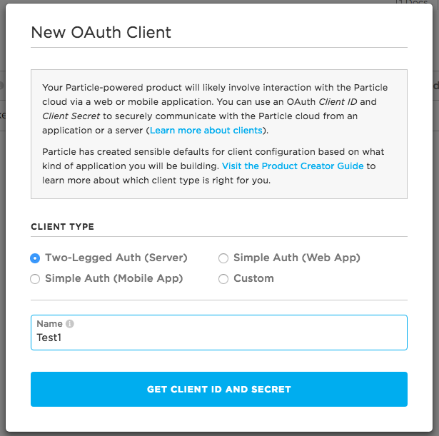
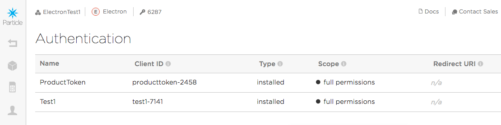
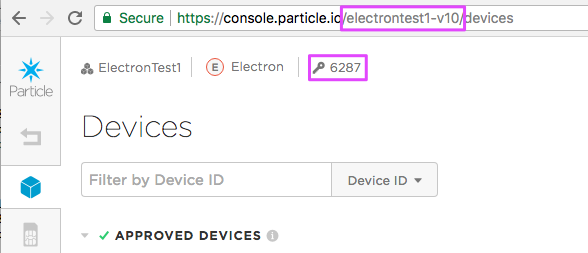

# Electron shadow customers

Often Electron product creators claim all of their devices to a single account controlled by the product creator. This is simple and works well, however it is possible to use Electrons with shadow customers like is common with Photon/P1 products.

If you've already studied the [manual Photon claiming](https://github.com/rickkas7/particle_notes/tree/master/manual-photon-claiming) instructions, you'll notice that this really the same up to the *Create a product claim code* step in that document. You can jump forward to that section now, if desired.

### Creating an OAuth client

In order to use the product APIs, you need a product access token. Creating one is a two-step process. The first part is to create an OAuth client.

- Open your product in the [console](https://console.particle.io)
- Open the **Authentication** tab.
- Click **New Client**.



You will want to create **Two-legged Auth (Server)** client. In the next screen, you will get a token. Copy and paste this as you can't get it back again. It's also important to keep this a secret. And, it's not your product access token.



In the next steps you'll need a few things:

- The **Name** field matches the name of the product (ElectronTest1)
- The OAuth **Client ID** field will be needed to make API calls (test1-7141)
- The OAuth client secret we got when creating a new client. In the examples below, `8804b8cbca56e71b275fb9ebd10cada2bb515e9a` is the token we got.

### Create a product bearer token

In order to use the some of the product APIs you need a product bearer token. Here's a command in curl to create one:

```
curl https://api.particle.io/oauth/token -u "test1-7141:8804b8cbca56e71b275fb9ebd10cada2bb515e9a" -d grant_type=client_credentials 
```

- `test1-7141 ` is the OAuth client ID (two-legged server type)
- `8804b8cbca56e71b275fb9ebd10cada2bb515e9a ` is the OAuth client secret

Note that the username and password passed in the -u option are the client ID created above and the access token for that client. 

That call will return something like this:

```
{
  "token_type":"bearer",
  "access_token":"585f9e53abb125535c2227d298369b6a77c128cf",
  "expires_in"7776000,
  "refresh_token":"32a2f31809cf6eff957d593c187f88075e9dadd4"
}
```

That access_token `585f9e53abb125535c2227d298369b6a77c128cf ` is the one you need!

The reason for all of this is that the client token needs to be kept safe because it has the ability to create new tokens. The bearer token you use to authenticate individual requests has a shorter life and is more "disposable" in case it gets into the wrong hands.

### Product ID or Slug

Most of the product APIs include `:productOdOrSlug` in the URL.

Your product ID is a number, located next to the key on the top of your priduct window. It's 6287 in the screenshot below.

You can also use the string in the URL. In this example, its **electrontest1-v10**.



Armed with these two things, you can now make product API calls!

Get information about your product:

```
curl https://api.particle.io/v1/products/6287?access_token=585f9e53abb125535c2227d298369b6a77c128cf
```

Or using the slug:

```
curl https://api.particle.io/v1/products/electrontest1-v10?access_token=585f9e53abb125535c2227d298369b6a77c128cf
```

### Add the device to the product

It's not obvious from the documentation, but you have to [add the device ID to the product](https://docs.particle.io/reference/api/#import-devices-into-product) before it can be claimed using two-legged auth. 

Here's the command I used:

```
curl -X POST https://api.particle.io/v1/products/6287/devices -d access_token=585f9e53abb125535c2227d298369b6a77c128cf -d id=b1eeaa1f7cdc4eda5d6aa375
```

```
{"updated":1,"nonmemberDeviceIds":[],"invalidDeviceIds":[]}
```

- `6287` is the product ID
- access_token is the product bearer token generated above
- id is the device ID to add

You can also do this from a file, and also using the console. Imagine you are making a product based on the Electron. You'd buy trays of Electron and import those device IDs into the console for your product. This is what prevents a user from turning a generic Electron into your product.

## Creating a customer

```
curl -X POST https://api.particle.io/v1/products/6287/customers -u "test1-7141:8804b8cbca56e71b275fb9ebd10cada2bb515e9a" -d email=customer30@company.com -d no_password=true
```

```
{"token_type":"bearer","access_token":"f9e01db22a020a35be7e6870093155b2a9675683","expires_in":7776000,"refresh_token":"6d3680db6ffcda58ef85ba24dbf11e7105a9ad2e","scope":"customer=customer30@company.com"}
```

- `6287` is the product ID
- `test1-7141` is the OAuth client ID (two-legged server type)
- `8804b8cbca56e71b275fb9ebd10cada2bb515e9a` is the OAuth client secret
- `customer30@company.com` is the customer email
- `no_password=true` says we're controlling the access tokens via two-legged auth; no login is allowed.

If the customer already exists, you need to create a new client credentials token instead:

```
curl -X POST https://api.particle.io/oauth/token -u "test1-7141:8804b8cbca56e71b275fb9ebd10cada2bb515e9a" -d grant_type=client_credentials -d scope=customer=customer30@company.com 
```

- `test1-7141` is the OAuth client ID (two-legged server type)
- `8804b8cbca56e71b275fb9ebd10cada2bb515e9a` is the OAuth client secret
- `customer30@company.com` is the customer email. Note that it really is `scope=customer=`*email*.

Note that the email doesn't actually have to be your customer's email. If you are using simple auth and you want to use password recovery it does need to be a valid email, but for two-legged shadow customers it does not.

One really confusing thing: When you create a customer it does not appear in your product's customer list! It exists, because if you try to create it again it won't let you, but it won't appear in the list until the customer has claimed a device.

Also, you really need to use your OAuth client ID and secret in the basic auth (-u option). It won't create a token if you only use the product bearer token in a access_token.

### Claim the device to the customer

It's not necessary to use a product endpoint to claim the device as claiming the device automatically will associate it with the product since the device ID has been added to the product. Also, the customer is associated with the product.

```
curl https://api.particle.io/v1/devices -d id=b1eeaa1f7cdc4eda5d6aa375 -d access_token=f9e01db22a020a35be7e6870093155b2a9675683
```

```
{"customer_id":"5ad7788bdef33c046763d31c","product_id":6287,"updated_at":"2018-04-18T17:20:10.880Z","id":"b1eeaa1f7cdc4eda5d6aa375","connected":true,"ok":true}
```

The device now shows up with the owner as customer30@company.com! It also shows up in the customers tab. So far so good!

### Device Firmware

For testing, I used this firmware. I used **Mark As Development Device** so I could just flash the firmware by USB and not have to upload the firmware binary.

```
#include "Particle.h"

PRODUCT_ID(6287);
PRODUCT_VERSION(1);

void testEventHandler(const char *event, const char *data);

int counter = 0;
unsigned long lastIncrement = 0;

void setup() {
	Serial.begin(9600);
	Particle.variable("counter", counter);
	Particle.subscribe("testEvent", testEventHandler, MY_DEVICES);
}

void loop() {

	if (millis() - lastIncrement > 1000) {
		lastIncrement = millis();
		counter++;
	}
}

void testEventHandler(const char *event, const char *data) {
	Serial.printlnf("testEventHandler called %s", data);
}

```


### Interacting with the Electron as a customer

The customer access token can be used in various API calls. For example, to list the customer's devices:

```
$ curl https://api.particle.io/v1/devices?access_token=f9e01db22a020a35be7e6870093155b2a9675683
```
- f9e01db22a020a35be7e6870093155b2a9675683 is a customer access token


Get the value of a variable:

```
curl https://api.particle.io/v1/devices/b1eeaa1f7cdc4eda5d6aa375/counter?access_token=f9e01db22a020a35be7e6870093155b2a9675683
```

```
{"cmd":"VarReturn","name":"counter","result":4307,"coreInfo":{"last_app":"","last_heard":"2018-04-18T17:28:02.716Z","connected":true,"last_handshake_at":"2018-04-18T17:27:20.401Z","deviceID":"b1eeaa1f7cdc4eda5d6aa375","product_id":6287}
```

- 3b0021001747353236343033 is the device ID to query
- temp is the variable name
- f9e01db22a020a35be7e6870093155b2a9675683 is a customer access token

Publish a private event to the device:

```
curl https://api.particle.io/v1/devices/events \
       -d "name=testEvent" \
       -d "data=testing!" \
       -d "private=true" \
       -d "access_token=f9e01db22a020a35be7e6870093155b2a9675683"
```       

And this appeared in the serial console:

```
testEventHandler called 
```
