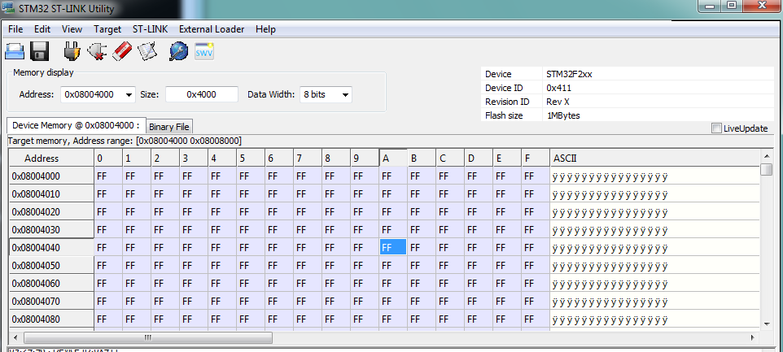
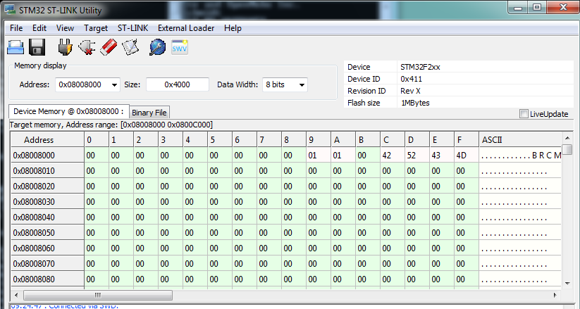
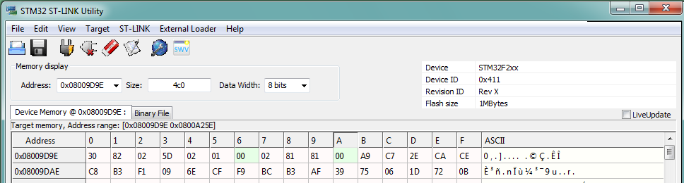

# Fixing P1 keys using JTAG

If you erase the configuration DCT sectors, you'll find that you can no longer connect to the cloud. For Photons, Electrons, and P1s with USB, the easiest way to fix this is to use:

```
particle keys server
particle keys doctor YOUR_DEVICE_ID
```

These only work in DFU mode, so if you don't have a USB interface on your P1 board, you'll need to do it manually using JTAG/SWD.

## Using ST-LINK/V2

In the example here, I've used an actual ST-LINK/V2 and their Windows software, but you can do this with an inexpensive SWD USB stick and openocd, if you prefer.

Install the [ST-LINK/V2 software for Windows](http://www.st.com/en/development-tools/st-link-v2.html), if you have not already done so. The software is at the bottom of that page.  

The pins on the connector are numbered this way when you have the programmer positioned so the logo is upright and the notch is on the bottom of the 20-pin connector.

|||||||||||
|:-:|:-:|:-:|:-:|:-:|:-:|:-:|:-:|:-:|:-:|
| 2 | 4 | 6 | 8 | 10 | 12 | 14 | 16 | 18 | 20 |
| 1 | 3 | 5 | 7 | 9  | 11 | 13 | 15 | 17 | 19 |
| | | | | notch | | | | | 
 
 
| Pin | Function | Color | P1 Pin |
| --- | --- | --- | --- |
| 1 | VCC | Red | 3V3 |
| 4 | GND | Brown | GND | 
| 7 | SWDIO | Orange | D7 |
| 9 | SWCLK | Yellow | D6 |


With the ST-LINK, make sure you connect the VCC line to 3V3. It's used to detect the device voltage, and if you don't connect it, it does not work reliably.

In the Settings, you will probably need to select:

- **SWD** (you can use JTAG if you connect the rest of the pins)
- **4.0 MHz** (though slower speeds will work too)
- **Access Port 0**
- **Hot Plug** mode 
- **Software System Reset** reset mode

Also, be sure to put the P1 into DFU mode (blinking yellow). In normal operating mode, you likely will not be able to connect by SWD unless you have a SWD-enabled build installed.

## About the DCTs

There are two configuration sectors in the flash memory:

| Region | Start Address | End Address | Size |
|:---|---|---|---|
| Bootloader | 0x8000000 | 0x8004000 | 16 KB |
| DCT1 | 0x8004000 | 0x8008000 | 16 KB |
| DCT2 | 0x8008000 | 0x800C000 | 16 KB |
| EEPROM1 | 0x800C000 | 0x8010000 | 16 KB |
| EEPROM2 | 0x8010000 | 0x8020000 | 64 KB |

When the flash is written to, it switches between one sector or the other, so there's no telling which one will be in use. Here's the not in use, blank one, which is all 0xFFs.



And the not blank one, which isn't all 0xFFs



Within that flash is the configuration for the Wi-Fi module, as well as the Particle configuration. That's this mapping from the data sheet:


| Region | Offset | Size |
|:---|---|---|
| system flags | 0 | 32 |
| version | 32 | 2 |
| device private key | 34 | 1216 |
| device public key | 1250 | 384 |
| ip config | 1634 | 120 |
| feature flags | 1754 | 4 |
| country code | 1758 | 4 |
| claim code | 1762 | 63 |
| claimed | 1825 | 1 |
| ssid prefix | 1826 | 26 |
| device code | 1852 | 6 |
| version string | 1858 | 32 |
| dns resolve | 1890 | 128 |
| reserved1 | 2018 | 64 |
| server public key | 2082 | 768 |
| padding | 2850 | 2 |
| flash modules | 2852 | 100 |
| product store | 2952 | 24 |
| antenna selection | 2976 | 1 |
| cloud transport | 2977 | 1 |
| alt device public key | 2978 | 128 |
| alt device private key | 3106 | 192 |
| alt server public key | 3298 | 192 |
| alt server address | 3490 | 128 |
| device id | 3618 | 12 |
| radio flags | 3630 | 1 |
| mode button mirror | 3631 | 32 |
| led mirror | 3663 | 96 |
| led theme | 3759 | 64 |
| reserved2 | 3823 | 435 |

What's a little less obvious is that this is 0x1d7c (7548) bytes into the DCT. 

So if you want to private key, you take the DCT offset 0x1d7c and add in the offset (34 = 0x22) and you get 0x01d7c + 0x22 = 0x1d9e. 

And that starts the start of either DCT1 (0x08004000) or DCT2 (0x08008000):

- 0x08004000 + 0x1d7c + 0x22 = 0x08005dc0
- 0x08008000 + 0x1d7c + 0x22 = 0x08009dc0

That's the offset you want to read from and you want 1216 (0x4c0) bytes.



You can then use the File-Save option to save this as a .bin file.

If you're using openocd, from the telnet interface:

```
dump_image devprivatekey.bin 0x08009dc0 0x4c0
```

If you're experimenting with a P1 that has a USB interface, you can test this out using dfu-util:

```
dfu-util -d 2b04:d00a -a 1 -s 34:1216 -U devprivatekey.bin
```

This should produce the same bytes as ST-LINK does.

It should also be the same as:

```
particle keys save device.der
```

The file generated by particle keys save will be shorter as the 0xFF padding at the end is removed. The .bin files are really der encoded RSA private keys.

On the Mac, Linux, or Windows using cygwin, you may be able to use the od program to display the private key nicely:

```
od -A x -t x1 devprivatekey.bin
```

(That says to show the addresses in hex, and show the data in 1 byte hex quantities.)

## Uploading the key

Once you have .bin file from ST-LINK or openocd, you need to get the PEM formatted public key. This is done using openssl:

```
openssl rsa -in devprivatekey.bin -inform DER -pubout -out device.pub.pem
```

Under Windows, openssl may not be in your path and you may need to specify the full path:

```
c:\OpenSSL-WIN32\bin\openssl rsa -in devprivatekey.bin -inform DER -pubout -out device.pub.pem
```

You can then use the particle keys send program to upload your device public key to the cloud.

```
particle keys send YOUR_DEVICE_ID device.pub.pem
```

