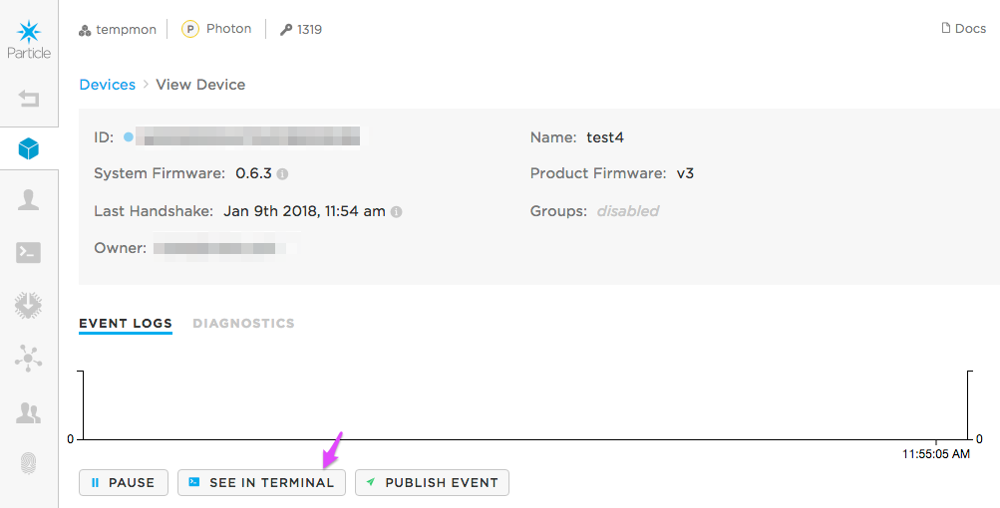

# Forcing an Electron OTA System Firmware Update

Once in a while you may find that an Electron will get stuck in safe mode after initiating a product firmware update that requires a system firmware update. Most of the time you can get the device out of this state by manually flashing the system firmware parts OTA.

## Get the system firmware binaries

You must download the 3 Electron system firmware binary parts (2 parts for 0.5.3) first. You can use any compatible version, but here are some common ones. 

Note that even if your product firmware only requires 0.6.2, for example, you can still install 0.6.4 on your device.

### 0.6.4

[0.6.4 Release](https://github.com/particle-iot/firmware/releases/tag/v0.6.4)

- [system-part1-0.6.4-electron.bin](https://github.com/particle-iot/firmware/releases/download/v0.6.4/system-part1-0.6.4-electron.bin)
- [system-part2-0.6.4-electron.bin](https://github.com/particle-iot/firmware/releases/download/v0.6.4/system-part2-0.6.4-electron.bin)
- [system-part3-0.6.4-electron.bin](https://github.com/particle-iot/firmware/releases/download/v0.6.4/system-part3-0.6.4-electron.bin)


### 0.5.5

[0.5.5 Release](https://github.com/particle-iot/firmware/releases/tag/v0.5.5)

- [system-part1-0.5.5-electron.bin](https://github.com/particle-iot/firmware/releases/download/v0.5.5/system-part1-0.5.5-electron.bin)
- [system-part2-0.5.5-electron.bin](https://github.com/particle-iot/firmware/releases/download/v0.5.5/system-part2-0.5.5-electron.bin)


## Important warning for versions prior to 0.5.3

Important note: If the device previously had a version prior to 0.5.3, such as the original factory default of 0.4.6, you must do a two-stage upgrade. First to 0.5.3 (or 0.5.4 or 0.5.5), then to whatever version you want, like 0.6.4. If you fail to do this, you will likely get the device into a state where you'll have to do a USB system firmware update to get out of the state.

## Set up the upload script

There isn't a built-in command in the Particle CLI for doing this, so you'll need to use curl and a script. This will work on Mac and Linux, and should work under Windows using Cygwin.

Here's the script:

```
#!/bin/bash                                                                     

# usage: ./flash.sh <device_id> <filename>                                      
if [ -z "$2"]; then
    echo "USAGE: ./flash.sh <device_id> <filename>"
    exit 1;
fi

# Replace 1234 with your product number!                                        

curl -X PUT "https://api.particle.io/v1/products/1234/devices/"${1}"?access_token=PASTE_ACCESS_TOKEN_HERE" \
       -F file=@${2} \
       -F file_type=binary
```

Make sure you edit these two things:

- Replace 1234 in the URL with your product number
- Replace `PASTE_ACCESS_TOKEN_HERE` with the access token you get in the next step.

Of course you could just type the curl command directly, but it's a little unwieldy and hard to remember.

## Get an access token

To get a product access token, click on:

- Your product
- Devices (that's usually already selected)
- View a single device
- Click **See in Terminal**



That screen will show you an access token that you can paste into the previous step. Note that this access token will be revoked when you close the console window for security reasons.


## Flash the code

You need to flash each of the 3 parts in sequence, but you need to wait until the operation is complete before moving onto the next part. The easiest way to do this is to monitor the Event Log, the best choice is usually the device event log in the console, since it only shows events for the device you are interested in. 

Using the script above:

```
bash flash.sh 28c8b06ce19895f2178193b0 system-part1-0.6.4-electron.bin
```

Wait until the Event logs shows the device come online again in safe mode, then:

```
bash flash.sh 28c8b06ce19895f2178193b0 system-part2-0.6.4-electron.bin
```

And if using 0.6.0 or later, part 3:

```
bash flash.sh 28c8b06ce19895f2178193b0 system-part3-0.6.4-electron.bin
```

(Replace 28c8b06ce19895f2178193b0 with your device ID, of course.)


## Your own developer Electron

If you're already logged into the CLI as the same account that owns the device, you can more easily just do this using particle flash:

Make sure you flash the parts in the order 1, 2, 3 and wait for the device to come back online in safe mode before flashing the next part.

```
particle flash 28c8b06ce19895f2178193b0 system-part1-0.6.4-electron.bin
particle flash 28c8b06ce19895f2178193b0 system-part2-0.6.4-electron.bin
particle flash 28c8b06ce19895f2178193b0 system-part3-0.6.4-electron.bin
```
