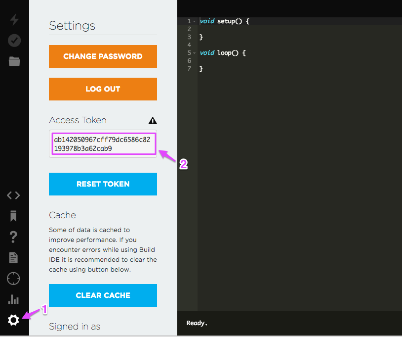
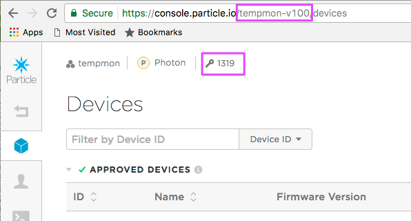

# Manual Photon claiming

This is simple example of how to claim a Photon device using the SoftAP APIs, instead of the phone device APIs or CLI. You might do this if you are making a computer-based setup tool instead of a phone-based one.

The first section shows how to set up a regular developer device. The second section shows how to set up a product device with two-legged auth and a shadow customer.

## Claiming a developer (non-product) device

### Get an access token

When you use normal, non-product APIs, you use a user token. One way to get your user token is to use [https://build.particle.io](https://build.particle.io). Click on the Settings icon (1) then copy and paste the Access Token (2).



You can also do this using the [oauth/token API](https://docs.particle.io/reference/api/#generate-an-access-token) if you prefer.

Remember to keep your access token secret; they allow access to your account to anyone who has the token! 

(All of the tokens in this document are fake, by the way.)


### Create a claim code

Use the [device_claims API](https://docs.particle.io/reference/api/#create-a-claim-code) to create a new claim code for the Photon:

```
$ curl -X POST https://api.particle.io/v1/device_claims?access_token=ab142050967cff79dc6586c82193978b3a62cab9
```

- `ab142050967cff79dc6586c82193978b3a62cab9` is the access token I got from Particle build

You should get back something like this containing the claim code (and also all of the devices belonging to your account:

```
{
  "claim_code":"4i8pwFwPkImsnLmIj54BYJA4Z94j0OLyl7vwKecELzYGKjS9mBbM5Vra6H9T0DI",
  "device_ids":[...]
}
```

### Connect to the Photon Wi-Fi

Presumably at this point the Photon is blinking blue (listening mode) because it has not yet been configured.

Connect your computer (or whatever you're connecting from) to the Photon Wi-Fi network (Photon-XXXX) and test it out by getting the device id:

```
$ curl http://192.168.0.1/device-id
{"id":"3B0021001747353236343033","c":"1"}
```

Beware of the device ID that is returned by this call. It uses uppercase letters for the a-f, but many of the APIs expect the letters to be lowercase. 

### Set the claim code

Set the claim code you received above using a command like:

```
$ curl -X POST -d '{"k":"cc","v":"4i8pwFwPkImsnLmIj54BYJA4Z94j0OLyl7vwKecELzYGKjS9mBbM5Vra6H9T0DI"}' http://192.168.0.1/set
```

- `4i8pwFwPkImsnLmIj54BYJA4Z94j0OLyl7vwKecELzYGKjS9mBbM5Vra6H9T0DI` is the claim code we got in the previous step.

If you did it correctly, this should be the result:

```
{"r":0}
```

If you didn't do it correctly, you'll get back something like this, or possibly no response at all.

```
{"r":-1}
```

If you pass an invalid claim code, such as one that's expired, the result will still be 0 but the claiming will fail and the Photon will remain in the unclaimed state.

### Get the public key

You'll need the device public key in order to encrypt the Wi-Fi password. 

```
$ curl http://192.168.0.1/public-key
{"b":"30819F300D06092A864886F70D010101050003818D0030818902818100BF084F0854C8860541285B100606F6CEB467E652726606614482106E2B7521888EB8B7894C526E6D715D8E4AC13618047F5777E6A91EE37E9C12887854D7279920CFD0FC01CCB425156ACA3977B766F922483770B4D35FF9D56404D967E9176F3BE8CD5AC949FC84E4DB77378E85B444F7D58747CF9F1A59A9FAC3E1D573B56F0203010001000000000000000000000000000000000000000000000000000000000000000000000000000000000000000000000000000000000000000000000000000000000000000000000000000000000000000000000000000000000000000000000000000000000000000000000000000000000000000000000000000000000000000000000000","r":0}
```

The actual key is the part after the `"b":"` up to the next `"`, or in other words:

```
30819F300D06092A864886F70D010101050003818D0030818902818100BF084F0854C8860541285B100606F6CEB467E652726606614482106E2B7521888EB8B7894C526E6D715D8E4AC13618047F5777E6A91EE37E9C12887854D7279920CFD0FC01CCB425156ACA3977B766F922483770B4D35FF9D56404D967E9176F3BE8CD5AC949FC84E4DB77378E85B444F7D58747CF9F1A59A9FAC3E1D573B56F0203010001000000000000000000000000000000000000000000000000000000000000000000000000000000000000000000000000000000000000000000000000000000000000000000000000000000000000000000000000000000000000000000000000000000000000000000000000000000000000000000000000000000000000000000000000
```

### Set up Wi-Fi

Setting up Wi-Fi by hand is a super huge pain. For experimenting with claiming, you'll be much better off just configuring the Wi-Fi using the CLI, using:

```
$ particle serial wifi
```

However, if you want to know how that works internally, here we go:

You'll need a bunch of parameters in order to configure Wi-Fi, not just the SSID and password. You also need the security type and channel. The easiest way is to use scan-ap:

```
$ curl http://192.168.0.1/scan-ap
```

For reference, however, the security type values are:

- open: 0
- wep_psk: 1
- wep_shared: 32769 (0x8001)
- wpa_tkip: 2097154 (0x00200002)
- wpa_aes: 2097165 (0x00200004)
- wpa2_tkip: 4194306(0x00400002)
- wpa2_aes: 4194308 (0x00400004)
- wpa2_mixed: 4194310 (0x00400006)
- wpa2: 4194310 (0x00400006)

The other thing you need is the secure password. This is an encrypted version of the Wi-Fi password. I had trouble doing this using just openssl, so I've included a simple node program to calculate the encrypted password.

If you're in the directory with package.json and wifipass.js you'll need to install the dependencies the first time you use it:

```
$ npm install
```

The first argument is the contents of the "b" key when getting your public key, above. The second is your actual Wi-Fi password. The tool prints out the encrypted version.

```
$ node wifipass.js 30819F300D06092A864886F70D010101050003818D0030818902818100BF084F0854C8860541285B100606F6CEB467E652726606614482106E2B7521888EB8B7894C526E6D715D8E4AC13618047F5777E6A91EE37E9C12887854D7279920CFD0FC01CCB425156ACA3977B766F922483770B4D35FF9D56404D967E9176F3BE8CD5AC949FC84E4DB77378E85B444F7D58747CF9F1A59A9FAC3E1D573B56F0203010001000000000000000000000000000000000000000000000000000000000000000000000000000000000000000000000000000000000000000000000000000000000000000000000000000000000000000000000000000000000000000000000000000000000000000000000000000000000000000000000000000000000000000000000000 mywifipassword
encrypted password: ad8965e3ddd9dc9544176adda3e35d70e8fb215e7de92da753fdde5829bba0f96d2f02162f1facd2ec08f93286010cd6c41569a9cf2190b5d6c869083bd11933201492ba9ea0a1a1265298691e23e68ce09f54f7bd50fe2d6f7308d4a412e0f95a5f14efff311314af71f4516e04af120b8619196a6c9a4876b69964ad06e608
```

Now you have everything you need to configure Wi-Fi:

```
$ curl -X POST http://192.168.0.1/configure-ap -d '{"idx":0,"ssid":"TestRouter","sec":4194308,"ch":6,"pwd":"ad8965e3ddd9dc9544176adda3e35d70e8fb215e7de92da753fdde5829bba0f96d2f02162f1facd2ec08f93286010cd6c41569a9cf2190b5d6c869083bd11933201492ba9ea0a1a1265298691e23e68ce09f54f7bd50fe2d6f7308d4a412e0f95a5f14efff311314af71f4516e04af120b8619196a6c9a4876b69964ad06e608"}'
```

- idx is the index to save to, 0 is the first.
- ssid is the SSID of the network, `TestRouter`
- sec is the security type of the network, `4194308`
- ch is the channel number, `6`
- pwd is the encrypted password, calculated above

If the parameters look valid, you should get back:

```
{"r":0}
```

You'll still get back 0 if you have an invalid Wi-Fi configuration; you'll just go back to blinking blue if the data isn't quite valid, such as an invalid password in correctly formatted JSON data.

### Connect to Wi-Fi

If you manually configured the Wi-Fi you need to tell the Photon to reboot:

```
$ curl -X POST http://192.168.0.1/connect-ap -d '{"idx":0}'
```
	
At this point, with any luck it will go through the normal steps of blinking green, blinking cyan, fast blinking cyan, and breathing cyan. And the device will be claimed to your account, since you used a claim code.

You can tell using:

```
particle list
```

among other methods.	

## Setting up a product device (two-legged)

This is similar to the first case, but some of the API end-points and tokens are different and there are a few more steps.

If you've run through the steps above and are using the same device, don't forget to unclaim it before you proceed:

```
$ particle device remove 3b0021001747353236343033
```

You may want to clear the Wi-Fi credentials as well by holding down the SETUP button until it blinks blue, then continue to hold down SETUP until it blinks blue rapidly (about 10 more seconds), then release. However you don't have to clear the Wi-Fi credentials, and if you leave them in place you can still test claiming.

Also, this demonstrates doing a two-legged auth client creation, similar to how it would work if you had your own server managing this process.

The process is different if you are using simple auth or phone-based setup!

### Creating an OAuth client

In order to use the product APIs, you need a product access token. Creating one is a two-step process. The first part is to create an OAuth client.

- Open your product in the [console](https://console.particle.io)
- Open the **Authentication** tab.
- Click **New Client**.


You will want to create **Two-legged Auth (Server)** client. In the next screen, you will get a token. Copy and paste this as you can't get it back again. It's also important to keep this a secret. And, it's not your product access token.


In the next steps you'll need a few things:

- The **Name** field matches the name we just created above (tempmon06)
- The OAuth **Client ID** field will be needed to make API calls (tempmon06-3459)
- The OAuth client secret we got when creating a new client. In the examples below, `460edfd8d70742dd1f1e75c3d5cac5973351465d` is the token we got.

### Create a product bearer token

In order to use the some of the product APIs you need a product bearer token. Here's a command in curl to create one:

```
curl https://api.particle.io/oauth/token -u "tempmon06-3459:460edfd8d70742dd1f1e75c3d5cac5973351465d" -d grant_type=client_credentials 
```

- `tempmon06-3459` is the OAuth client ID (two-legged server type)
- `460edfd8d70742dd1f1e75c3d5cac5973351465d` is the OAuth client secret

Note that the username and password passed in the -u option are the client ID created above and the access token for that client. 

That call will return something like this:

```
{
  "token_type": "bearer",
  "access_token": "5724113917ac1e1cbf80cae2e24dd27c56245bdb",
  "expires_in": 7776000,
  "refresh_token": "7ff08565378780581aa27eeb4eb92a4e4dbcc3a5"
}
```

That access_token `5724113917ac1e1cbf80cae2e24dd27c56245bdb` is the one you need!

The reason for all of this is that the client token needs to be kept safe because it has the ability to create new tokens. The bearer token you use to authenticate individual requests has a shorter life and is more "disposable" in case it gets into the wrong hands.

### Product ID or Slug

Most of the product APIs include `:productOdOrSlug` in the URL.

Your product ID is a number, located next to the key on the top of your priduct window. It's 1319 in the screenshot below.

You can also use the string in the URL. In this example, its **tempmon-v100**.



Armed with these two things, you can now make product API calls!

Get information about your product:

```
curl https://api.particle.io/v1/products/1319?access_token=5724113917ac1e1cbf80cae2e24dd27c56245bdb
```

Or using the slug:

```
curl https://api.particle.io/v1/products/tempmon-v100?access_token=5724113917ac1e1cbf80cae2e24dd27c56245bdb
```

### Add the device to the product

It's not obvious from the documentation, but you have to [add the device ID to the product](https://docs.particle.io/reference/api/#import-devices-into-product) before it can be claimed using two-legged auth. 

Here's the command I used:

```
$ curl -X POST https://api.particle.io/v1/products/1319/devices -d access_token=5724113917ac1e1cbf80cae2e24dd27c56245bdb -d id=3b0021001747353236343033
{"updated":1,"nonmemberDeviceIds":[],"invalidDeviceIds":[]}
```

- `1319` is the product ID
- access_token is the product bearer token generated above
- id is the device ID to add

You can also do this from a file, and also using the console. Imagine you are making a product based on the Photon. You'd buy trays of Photons and import those device IDs into the console for your product. This is what prevents a user from turning a generic Photon into your product.

### Create a customer and customer access token

We'll be creating a customer using the [customers](https://docs.particle.io/reference/api/#customers) API.

```
$ curl -X POST https://api.particle.io/v1/products/1319/customers -u "tempmon06-3459:460edfd8d70742dd1f1e75c3d5cac5973351465d" -d email=customer5@mycompany.com -d no_password=true
{"token_type":"bearer","access_token":"59993d84d58dcc198069a171e9c2c69b0d52a58b","expires_in":7776000,"refresh_token":"290ffe88586471303b56f9aa3ab994ffa767f2d7","scope":"customer=customer5@mycompany.com"}
```

- `1319` is the product ID
- `tempmon06-3459` is the OAuth client ID (two-legged server type)
- `460edfd8d70742dd1f1e75c3d5cac5973351465d` is the OAuth client secret
- `customer5@mycompany.com` is the customer email
- `no_password=true` says we're controlling the access tokens via two-legged auth; no login is allowed.

If the customer already exists, you need to create a new client credentials token instead:

```
curl -X POST https://api.particle.io/oauth/token -u "tempmon06-3459:460edfd8d70742dd1f1e75c3d5cac5973351465d" -d grant_type=client_credentials -d scope=customer=customer5@mycompany.com 
```

- `tempmon06-3459` is the OAuth client ID (two-legged server type)
- `460edfd8d70742dd1f1e75c3d5cac5973351465d` is the OAuth client secret
- `customer5@mycompany.com` is the customer email

Note that the email doesn't actually have to be your customer's email. If you are using simple auth and you want to use password recovery it does need to be a valid email, but for two-legged shadow customers it does not.

One really confusing thing: When you create a customer it does not appear in your product's customer list! It exists, because if you try to create it again it won't let you, but it won't appear in the list until the customer has claimed a device.

Also, you really need to use your OAuth client ID and secret in the basic auth (-u option). It won't create a token if you only use the product bearer token in a access_token.

### Create a product claim code

You don't do this step when using the Device Setup SDK for iOS or Android. You pass the shadow customer access token from the previous step to the Device Setup SDK and it takes care of creating a product claim code on behalf of your customer for you.

[Creating a claim code](https://docs.particle.io/reference/api/#create-a-claim-code) allows to cloud to know which user account, and in this case product, to associate the Photon with.

The `customer5@mycompany.com` shadow customer entry is completely hidden from the user; it's part of the claim code, however.

```
$ curl -X POST https://api.particle.io/v1/products/1319/device_claims?access_token=59993d84d58dcc198069a171e9c2c69b0d52a58b
```

- `1319` is the product ID
- The access token is a customer access token created in the previous step. This is so the device will be associated with that customer.

This will return something like this:

```
{"claim_code":"3GjxEdDu3eIWEs5C9WMun5etWsIC7KreXXHQ2JXAfBorHv+t26F04cFObo/FsL5","device_ids":[]}
```

Note that this takes a customer access token; this is how the device gets claimed to that customer in your product.

### Set the claim code

Connect to the Photon Wi-Fi network.

Set the claim code you received above using a command like:

```
$ curl -X POST -d '{"k":"cc","v":"3GjxEdDu3eIWEs5C9WMun5etWsIC7KreXXHQ2JXAfBorHv+t26F04cFObo/FsL5"}' http://192.168.0.1/set
```

If you did it correctly, this should be the result:

```
{"r":0}
```

If you didn't do it correctly, you'll get back something like this, or possibly no response at all.

```
{"r":-1}
```

If you pass an invalid claim code, such as one that's expired, the result will still be 0 but the claiming will fail and the Photon will remain in the unclaimed state.

This steps is also done by the Device Setup SDK.

### Set up everything else

Once you have set up the claim code, everything is the same as for developer devices:

- Get the public key
- Set up Wi-Fi
- Connect to Wi-Fi

If you haven't cleared the Wi-Fi credentials, you can just restart the Photon now:

```
$ curl -X POST http://192.168.0.1/connect-ap -d '{"idx":0}'
```

Now:

- The owner field in the product device list should be filled in
- The customer will appear in the Customers list!


### Interacting with the Photon as a customer

The customer access token can be used in various API calls. For example, to list the customer's devices:

```
$ curl https://api.particle.io/v1/devices?access_token=59993d84d58dcc198069a171e9c2c69b0d52a58b
```
- 59993d84d58dcc198069a171e9c2c69b0d52a58b is a customer access token


Get the value of a variable:

```
$ curl https://api.particle.io/v1/devices/3b0021001747353236343033/temp?access_token=59993d84d58dcc198069a171e9c2c69b0d52a58b
{"cmd":"VarReturn","name":"temp","result":1083,"coreInfo":{"last_app":"","last_heard":"2017-04-05T19:59:10.783Z","connected":true,"last_handshake_at":"2017-04-05T19:38:47.578Z","deviceID":"3b0021001747353236343033","product_id":1319}
```

- 3b0021001747353236343033 is the device ID to query
- temp is the variable name
- 59993d84d58dcc198069a171e9c2c69b0d52a58b is a customer access toen

If you are creating a phone app for the customer, you can use the customer access token and refresh token to allow them to access the device directly using the Particle API, for example.

This is also provides a way to publish events to a customer device with firmware that subscribes using the `MY_DEVICES` option.

### Restoring the device

To restore the device back to a developer device, use the [console](https://console.particle.io) and go to the Devices tab. Select your device, then click the ... button. The two options you need are:

- Unclaim device. This will unclaim the device from the user (customer5@mycompany.com in the example above). This allows the device to be transferred to a different customer.
- Remove device. The will remove the device ID from the device list, so when it is claimed again it won't be made a product device. This allows a device to be claimed as a regular developer device again.

After doing both options, if you want to add it back to your regular developer account, you'd do something like:

```
$ particle device add 3b0021001747353236343033
$ particle flash 3b0021001747353236343033 tinker
```

- `3b0021001747353236343033` is the device ID that was unclaimed and removed
- The flashing of tinker is to remove the product firmware.

There are additional hints at the [Photon reset page](https://github.com/rickkas7/photonreset) that describe how to completely wipe a device clean so it's basically in a factory reset state. This is useful when you are recycling customer devices.
