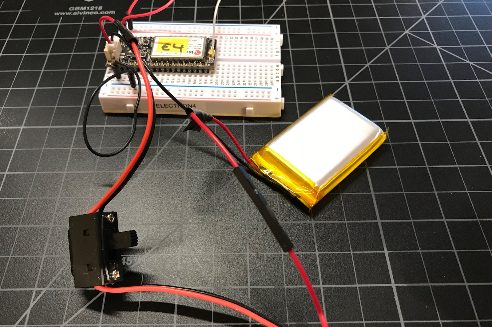
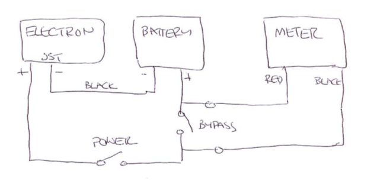

# Measuring Electron power consumption

*Tips for measuring Electron power consumption using an inexpensive digital multimeter (DMM)*

One of the difficulties with measuring power consumption of an Electron is the wide variation of power usage. It may use 1800 mA when connecting to a cellular tower (2G model), but as little as 90 µA in deep sleep mode. This can cause measurement difficulties with inexpensive DMMs.

I prefer to test using a battery, as that's most likely the situation you'll be interested in low power consumption, and when using, say, VIN, some of the current could be directed to charging the battery.

I spliced a switch into the battery circuit as well. This makes it easier to disconnect the battery without having to unplug the JST power connector.

Also, there's a male pin to female plug socket spliced in there, as well, and that's what used for current measurement.

As a schematic, it may make more sense:

The slide switch on the left is the power switch, which disconnects the battery.

The toggle switch on the right is the bypass switch, that shunts the meter connection. This is important.

You also want to make sure you have really good connections. You won't be able to keep a good enough connection just by pressing the meter probes against wires.

## The DMM scale dilemma

Like most DMMs, this one has multiple ranges, in this case, three: A, mA, and µA. 

The problem is that when you're in the µA scale, the meter does not provide sufficient current for the Electron to properly operate. Essentially, the Electron is starved for power if it tries to power up, and this causes the modem to not operate properly. Among other things, the modem cannot go to sleep when it does not have sufficient power. If your Electron is consuming 2 mA to 40 mA when it should be in deep sleep mode, this is one of the possible causes.

Some meters can power the Electron in mA scale, and some may require the A (amps) scale. 

The other problem is that most meters disconnect the circuit when you switch between modes, this interruption in power confuses the Electron, and may cause it to reboot, or at least not function reliably.

The solution to all of this is the use of the bypass switch, above.

## Testing tips

To eliminate any software issues and make sure you have your meter set up properly, it's a good idea to just [flash the Tinker app](https://github.com/rickkas7/particle_notes/tree/master/restoring-tinker) to your Electron.

Close the bypass switch so the meter is not supplying the current and power on the Electron.

If you double-tap the MODE button with the Electron, it should go into deep sleep mode after several seconds. 

Once the status LED is off, put the meter in uA scale and open the bypass switch. The Electron should be consuming about 90 µA in this mode, as shown in the picture above.

## More on sleep modes

There are a few caveats to entering sleep mode from your code. [The tips in this post](https://community.particle.io/t/electron-sleep-mode-deep-tips-and-examples/27823) may be helpful.
