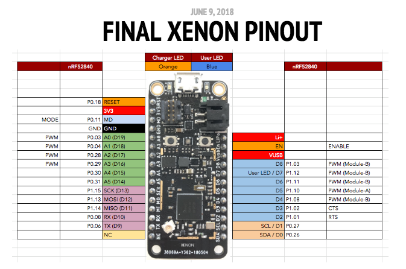

# Particle Mesh IO notes

We're still a few months from release of the Argon, Boron, and Xenon, but there's some interesting publicly available information we can peruse until the official documentation comes out.

The new devices all conform to the [Adafruit Feather Specification](https://learn.adafruit.com/adafruit-feather/feather-specification). That provides the specs for the number of pins (12 on one side, 16 on the other), spacing, and the general functions.

The next thing is the official final Xenon pinout has been released.

Finally, you'll want to download the [nRF52840 Product Specification](http://infocenter.nordicsemi.com/pdf/nRF52840_PS_v1.0.pdf).

**IMPORTANT:** *The information in this document is subject to change and may be in fact be wrong. It is based only from reviewing the publicly available documentation. Not all features available in hardware may be exposed by the system firmware.*

## GPIO

On the nRF52840, most pins can be used as GPIO. This includes the D pins, A pins, and the specialty ports like SPI, I2C, and serial, if you aren't using them. This is basically the same as the STM32.
 
## Analog Input (ADC)

There are 6 exposed ADC inputs A0-A5. 

While the nRF52840 supports 8 ADC channels, the other two are P0.02 and P0.05, which are not exposed, so there are only 6. You can use an I2C or SPI ADC, of course.

## Serial

There is a serial port on the RX and TX pins, and it supports optional hardware flow control (CTS/RTS on D3 and D2).

| Serial | Alt | nRF52840 |
| ------ | --- | -------- |
| TX     | D9  | P0.06    |
| RX     | D10 | P0.08    |
| CTS    | D3  | P1.02    |
| RTS    | D2  | P1.01    |

The nRF52840 has two hardware UARTs, and the optional second UART should be available on these pins. This could change.

| Serial | Alt | nRF52840 |
| ------ | --- | -------- |
| TX1    | D4  | P1.08    |
| RX1    | D5  | P1.10    |
| CTS1   | D6  | P1.11    |
| RTS1   | D8  | P1.03    |

## I2C

There is a dedicated set of pins for I2C on D0 and D1, just like the Photon and Electron.

The nRF52840 is more flexible than the STM32, however. There are two shared peripherals for I2C:

- ID 3 = I2C Master 0, I2C Slave 0 (it not used for SPI)
- ID 4 = I2C Master 1, I2C Slave 1 (if not used for SPI)

What this means is that you can have two I2C masters, one of each, or two I2C slaves, and they can be mapped to any GPIO.

It gets more complicated than that because some of the shared peripherals are shared with SPI. However, there are 4 SPI peripherals, so hopefully it will be possible to move things around if necessary.

And remember: not all of these hardware feature may be exposed by system firmware.

## SPI

There's a dedicated set of pins for SPI. 

The nRF52840 is more flexible than the STM32, however. There four SPI peripherals that can be assigned to any pins. However, two of the shared peripherals are shared with I2C, so you can only have four SPI ports if you don't use I2C.

- ID 3 = SPI Master 0 or SPI Slave 0 (if not used for I2C)
- ID 4 = SPI Master 1 or SPI Slave 1 (if not used for I2C)
- ID 35 = SPI Master 2 or SPI Slave 2
- ID 46 = SPI Master 3

And remember: not all of these hardware feature may be exposed by system firmware.

