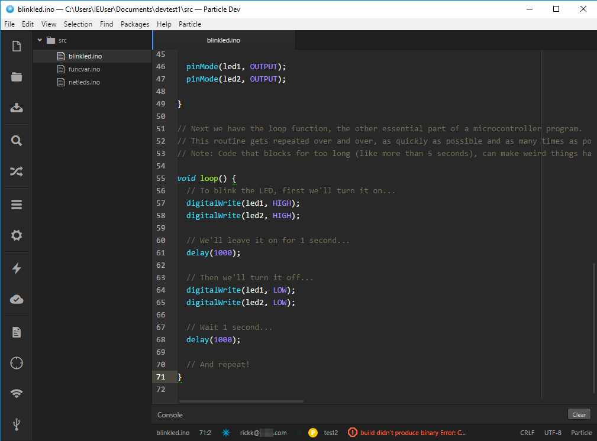
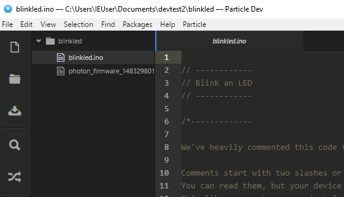
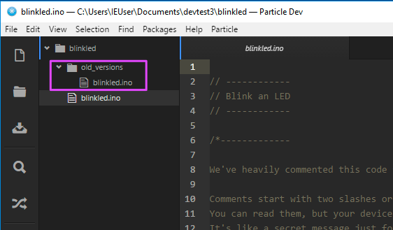
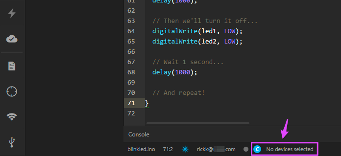
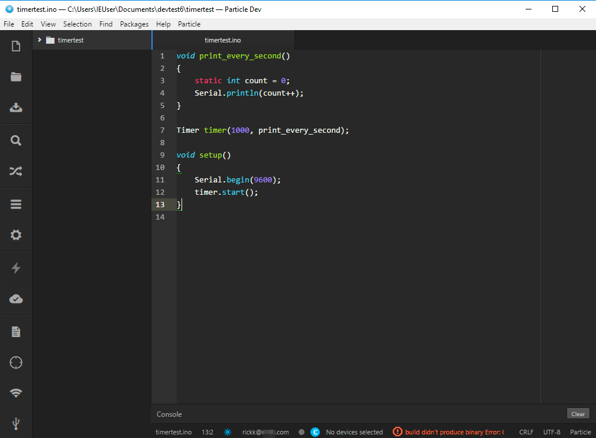
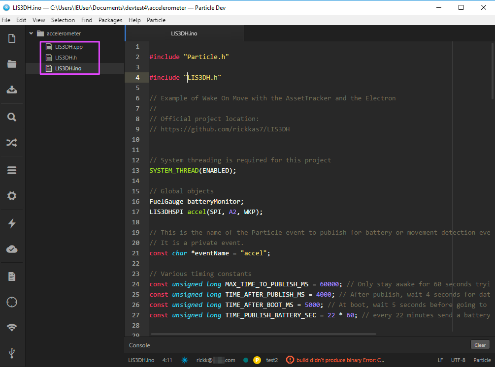
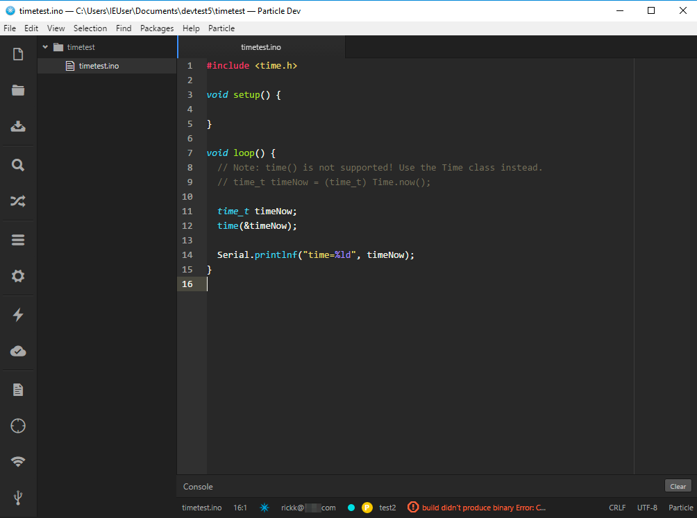
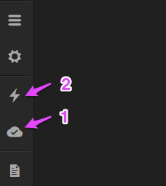
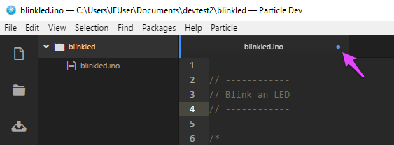

# Particle Dev Tips

Here are a few handy tips for using [Particle Dev](https://www.particle.io/products/development-tools/particle-local-ide), the Local IDE (Atom-based) for developing with the Particle Photon, Electron, etc.

## It does not build the open tab

One thing that catches some people is that Particle Dev does not build the open tab. 

This setup, with three different programs in the src directory does not work, and produces the dreaded build didn't produce binary error:



Even though blinkled.ino is the open tab, Particle Dev tries to build all of the files in the src directory (blinkled.ino, funcvar.ino and netleds.ino) together into a single program, which doesn't work because each is a complete, separate program with its own setup() and loop().

**Solution: Put each sketch/program in its own directory**



## It builds files in subdirectories, too

Don't put other source, like different versions, broken code, etc. in a subdirectory because all of the files in subdirectories are compiled into your program, too.



**Solution: Put other source in a different directory**


## Make sure you select your device

Always make sure you have a device selected by clicking on **No devices selected** at the bottom of the window if it is displayed.



You can still build with no device selected, but it defaults to a Core. This means that features that require a Photon or Electron like [software timers](https://docs.particle.io/reference/firmware/photon/#software-timers) will cause a build didn't produce binary error.



Once you select a Photon or Electron, this code will build properly.


## Build didn't produce binary

In addition to the reasons above, a few other ways you can get a build didn't produce binary error include:

### Having files with both .ino and .cpp extensions

In this case, the build failed because there were files LIS3DH.ino and LIS3DH.cpp. The solution is to rename LIS3DH.ino to something else, like LIS3DHTest.ino.



The reason is that during compile both LIS3DH.cpp and LIS3DH.ino produce an object file LIS3DH.o, and one overwrites the other.

### Using standard library function that's not implemented

Using a standard C or C++ library function that's not supported can cause the build didn't produce binary error.



And example of a more useful error message returned by the CLI is shown below.

### Program too large

I think a program that is too large to fit in flash can cause this error as well.

## Electron flashes magenta after uploading binary

Particle Dev always builds for the current released version of system firmware. This happens automatically in the cloud, even if you haven't upgraded your Particle Dev.

This is not typically a problem with Photons as they automatically upgrade themselves to the matching system firmware version using the safe mode healer.

Electrons, however, just go into safe mode (blinking magenta) because updating the Electron system firmware could use a lot of cellular data. In this case, the easiest solution is to upgrade the system firmware on the Electron.

The information on the latest version of system firmware is on the [Particle Firmware Update Thread](https://community.particle.io/t/particle-firmware-updates-thread/14378/36). Note that Dev does not use the pre-release versions with "rc" in their version numbers. That page also has links for various ways to upgrade, including using the firmware manage and the CLI.

Another option is to use the Particle CLI which allows you to choose which version of system firmware to build against.

## Using Particle CLI

The [Particle CLI](https://docs.particle.io/guide/tools-and-features/cli/) (Command Line Interface) is handy tool to have. The link has information on it and installation instructions, so if you have not already installed it, it's useful to do so.

One of the many features of the CLI is the ability to use the cloud compilers from the command line. These are the same compilers used by Particle Dev, but you can choose which system version to use, and also has much better error messages.

In the example above, where the unimplemented time function was used, instead of "Build didn't produce binary" you get this:

```
C:\Users\IEUser\Documents\devtest5\timetest>particle compile photon timetest.ino

Compiling code for photon

Including:
    timetest.ino
attempting to compile firmware
Compile failed. Exiting.
/usr/local/gcc-arm-embedded-gcc-arm-none-eabi-4_8-2014q2-20140609-linux-tar-bz2/bin/../lib/gcc/arm-none-eabi/4.8.4/../../../../arm-none-eabi/lib/armv7-m/libg_s.a(lib_a-gettimeofdayr.o): In function `_gettimeofday_r':
gettimeofdayr.c:(.text._gettimeofday_r+0xe): undefined reference to `_gettimeofday'
collect2: error: ld returned 1 exit status
make: *** [39cf41e5f80ee901319f3c84199fbdb6d06f79f84e26c713e7b1b8030d8d.elf] Error 1
```

This is much more helpful! You can switch back and forth between compile in Dev vs. compiling using the CLI without problems.

There are many options to the [particle compile](https://docs.particle.io/reference/cli/#compiling-remotely-and-flashing-locally) command explained in the documentation.

I often use a command line that looks like this:

```
particle compile electron myprogram.ino --target 0.5.3 --saveTo firmware.bin
```

The options are:

- electron: You need to specify the type of device you want to build for (core, photon, electron, or p1)
- myprogram.ino: The source file to build. This can be multiple files or a directory as well.
- --target 0.5.3: [optional] build for a specific system firmware version instead of the latest. This is useful if your Electron is not running the latest system firmware
- --saveTo firmware.bin: [optional] give a specific filename to save the binary to.

Once you have the firmware.bin file you can flash it using USB or over-the-air (OTA) using the particle flash CLI command.


## Compile in cloud does not always build

In older versions, if you have a firmware.bin file already, edited the source, then used **Compile in cloud and upload using cloud** the old binary would be uploaded instead of recompiling. Now, in most cases, the firmware.bin file will be deleted automatically, but you may still find it useful to always do a **Compile in cloud and show errors if any** (1) first, then do a **Compile in cloud and upload using cloud** (2), just to be sure.




## Changes not saved (occasionally)

This has been known to happen intermittently, at least on the Mac. It may have been fixed, because I haven't heard of it happening recently, but Command-S would occasionally not save files. You can tell because the blue dot next to the filename in the tab would not go away after saving. Selecting **Save All** from the menu would save and make the dot go away.




