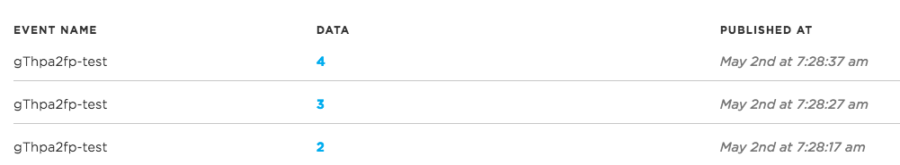

# Particle Public/Private Event Tips

*Tips for dealing with public and private events for Particle publish and subscribe*

Tests were performed on May 2, 2017 using system firmware 0.6.1.

## Private Events

Most of the time you'll probably want to use private events. These are only visible to the owner of the devices. (We'll discuss products in a later section of this document.)

### Sending private events from a device

This is the sample code I used for sending a private event:

```
#include "Particle.h"

int counter = 0;

void setup() {
	Serial.begin(9600);
}

void loop() {
	char eventData[64];
	snprintf(eventData, sizeof(eventData), "%d", ++counter);

	Particle.publish("gThpa2fp-test", eventData, PRIVATE);
	delay(10000);
}
```

I used an unique event name ("gThpa2fp-test") because I also ran tests for subscribing not using the private/my devices flags, and I didn't want to get flooded with events from other accounts.

### Receiving private events in the Event Log

The easiest way to monitor your events is the log in the [console](https://console.particle.io/logs).



### Receiving private events with the CLI

You can also monitor events using the [Particle CLI](https://docs.particle.io/reference/cli/#particle-subscribe).

You can use the `mine` keyword to get events from my devices only:

```
$ particle subscribe gThpa2fp-test mine
Subscribing to "gThpa2fp-test" from my personal stream (my devices only) 
Listening to: /v1/devices/events/gThpa2fp-test
{"name":"gThpa2fp-test","data":"42","ttl":"60","published_at":"2017-05-02T11:34:57.563Z","coreid":"xxx"}
{"name":"gThpa2fp-test","data":"43","ttl":"60","published_at":"2017-05-02T11:35:07.595Z","coreid":"xxx"}
```

Though if you leave the `mine` off, you'll get both public and private events. Even though the event was published as private, you'll still get the events this way:

```
$ particle subscribe gThpa2fp-test
Subscribing to "gThpa2fp-test" from the firehose (all devices) and my personal stream (my devices)
Listening to: /v1/events/gThpa2fp-test
{"name":"gThpa2fp-test","data":"36","ttl":"60","published_at":"2017-05-02T11:33:57.557Z","coreid":"xxxx"}
{"name":"gThpa2fp-test","data":"37","ttl":"60","published_at":"2017-05-02T11:34:07.557Z","coreid":"xxx"}
```

### Receiving private events on a device

Receiving private events on a Photon/Electron can be done using the `MY_DEVICES` option to [Particle.subscribe](https://docs.particle.io/reference/firmware/photon/#particle-subscribe-).

```
#include "Particle.h"

void myHandler(const char *event, const char *data);

void setup() {
	Serial.begin(9600);
	Particle.subscribe("gThpa2fp-test", myHandler, MY_DEVICES);
}

void loop() {
}

void myHandler(const char *event, const char *data) {
	Serial.printlnf("event=%s data=%s", event, data);
}

```

And the output on the serial monitor:

```
event=gThpa2fp-test data=5
event=gThpa2fp-test data=6
event=gThpa2fp-test data=7
```

What may be less obvious is that if you leave off the `MY_DEVICES` option, you *only* get public events. You do not receive private events from your own devices. In this way, subscribing is different than how the CLI behaves. This is discussed more in the public events section.


### Receiving private events with the cloud API

Receiving [stream of my events](https://docs.particle.io/reference/api/#get-a-stream-of-your-events) from the API works as you'd expect:

```
$ curl https://api.particle.io/v1/devices/events/gThpa2fp-test?access_token=xxx
:ok
```

And the output:

```
event: gThpa2fp-test
data: {"data":"1","ttl":"60","published_at":"2017-05-02T13:46:51.859Z","coreid":"xxx"}

event: gThpa2fp-test
data: {"data":"2","ttl":"60","published_at":"2017-05-02T13:47:01.833Z","coreid":"xxx"}
```

Receiving the [public stream of events](https://docs.particle.io/reference/api/#get-a-stream-of-events) from the API works like it does from the CLI. It returns both public and private events that match your prefix filter.

```
$ curl https://api.particle.io/v1/events/gThpa2fp-test?access_token=xxx
:ok
```

```
event: gThpa2fp-test
data: {"data":"12","ttl":"60","published_at":"2017-05-02T13:48:41.842Z","coreid":"xxx"}

event: gThpa2fp-test
data: {"data":"13","ttl":"60","published_at":"2017-05-02T13:48:51.842Z","coreid":"xxx"}
```


### Sending private events from the CLI

Sending a private event from the CLI just requires adding `--private` to the command:

```
$ particle publish gThpa2fp-test 100 --private
```

This showed up in the Photon serial output when subscribing using `MY_DEVICES`:

```
event=gThpa2fp-test data=100
```

In other words, `MY_DEVICES` also works with CLI and cloud API requests authenticated from your account.

### Sending private events from the cloud API

```
$ curl https://api.particle.io/v1/devices/events -d "name=gThpa2fp-test" -d "data=200" -d "private=true" -d access_token=xxx
```

This showed up in the Photon serial output when subscribing using `MY_DEVICES`:

```
event=gThpa2fp-test data=200
```

## Public Events

Public events are visible to anyone using the Particle cloud. You need to be careful when subscribing to public events, because they can come from anyone, and if the event name you're subscribed to is not sufficiently unique, you may get a large number of unexpected events.

### Sending public events from a device

I used this code to send a public event from a Photon:

```
#include "Particle.h"

int counter = 0;

void setup() {
	Serial.begin(9600);
}

void loop() {
	char eventData[64];
	snprintf(eventData, sizeof(eventData), "%d", ++counter);

	Particle.publish("gThpa2fp-test", eventData);
	delay(10000);
}
```

It's just like the code for private events except the Particle.publish call does not specify `PRIVATE` as a parameter.

### Receiving public events in the Event Log

The easiest way to monitor your events is the log in the [console](https://console.particle.io/logs). The event log only shows your events, however it will show them regardless of whether the events have the PRIVATE flag or not.

### Receiving public events with the CLI

While running the code above sending public events, you will still see them in the CLI if you subscribe using the `mine` option since they're from your device.

```
$ particle subscribe gThpa2fp-test mine
Subscribing to "gThpa2fp-test" from my personal stream (my devices only) 
Listening to: /v1/devices/events/gThpa2fp-test
{"name":"gThpa2fp-test","data":"2","ttl":"60","published_at":"2017-05-02T14:18:38.293Z","coreid":"xxx"}
{"name":"gThpa2fp-test","data":"3","ttl":"60","published_at":"2017-05-02T14:18:48.328Z","coreid":"xxx"}
```

It also works if you leave off the `mine` option:

```
$ particle subscribe gThpa2fp-test 
Subscribing to "gThpa2fp-test" from the firehose (all devices) and my personal stream (my devices)
Listening to: /v1/events/gThpa2fp-test
{"name":"gThpa2fp-test","data":"9","ttl":"60","published_at":"2017-05-02T14:19:48.299Z","coreid":"xxx"}
{"name":"gThpa2fp-test","data":"10","ttl":"60","published_at":"2017-05-02T14:19:58.302Z","coreid":"xxx"}
```

The main difference with publishing not using the `PRIVATE` flag is that it can be received when logged into a different Particle account:

```
C:\Users\IEUser>particle subscribe gThpa2fp-test
Subscribing to "gThpa2fp-test" from the firehose (all devices) and my personal stream (my devices)
Listening to: /v1/events/gThpa2fp-test
{"name":"gThpa2fp-test","data":"1","ttl":"60","published_at":"2017-05-02T14:41:35.102Z","coreid":"xxx"}
{"name":"gThpa2fp-test","data":"2","ttl":"60","published_at":"2017-05-02T14:41:45.072Z","coreid":"xxx"}
```


### Receiving public events on a device

This code will receive public events on a Photon or Electron:

```
#include "Particle.h"

void myHandler(const char *event, const char *data);

void setup() {
	Serial.begin(9600);
	Particle.subscribe("gThpa2fp-test", myHandler);
}

void loop() {
}

void myHandler(const char *event, const char *data) {
	Serial.printlnf("event=%s data=%s", event, data);
}
```

One thing to beware of: This will only subscribe to public events. If you send a PRIVATE event, it will not be received by the code above, even if it is from one of your devices!


### Sending public events from the CLI

This CLI command will send a public event that can be received by the code above, as it does not include the `--private` option.

```
particle publish gThpa2fp-test 100
```

### Sending public events from the cloud API

Using the `private=false` option (or leaving it out entirely) sends a public event. This event is received by the code above.

```
$ curl https://api.particle.io/v1/devices/events -d "name=gThpa2fp-test" -d "data=200" -d "private=false" -d access_token=xxx
```

## Private Product Events

Product events are currently designed to work in the device-to-cloud direction, allowing individual devices to send to the product creator via webhook, SSE, etc..

There currently is limited support for the product creator to send product events to be received by product devices.

### Receiving private events on a product device

I used this code on my Photon. Note that this is installed as product firmware, and the device is owned by a user, like a simple auth product device would be configured.

```
#include "Particle.h"

// Make sure you update these with your product ID and version!
PRODUCT_ID(1319);
PRODUCT_VERSION(23);


void myHandler(const char *event, const char *data);

void setup() {
	Serial.begin(9600);
	Particle.subscribe("gThpa2fp-test", myHandler, MY_DEVICES);
}

void loop() {
}

void myHandler(const char *event, const char *data) {
	Serial.printlnf("event=%s data=%s", event, data);
}
```

### Sending private events from the CLI

Sending a private event from the CLI from the same account that owns the Photon works as expected, the event is received by the Photon:

```
$ particle publish gThpa2fp-test 101 --private
```

A public event is not be received by the Photon, as would be expected if you use MY_DEVICES on the subscribing side, as that's the way it works for non-product devices as well.

Note that this is just sending a regular event, not a product event.


### Sending private product events from the cloud

In order to access the product APIs you'll need a product bearer access token. That's described in greater detail in [Authenticating Particle product APIs](https://github.com/rickkas7/particle_notes/tree/master/authenticating-product-apis).

```
$ curl https://api.particle.io/v1/products/1319/events -d "name=gThpa2fp-test" -d "data=102" -d "private=true" -d "access_token=xxx"
```

This was received by my product device:

```
event=gThpa2fp-test data=102
```

However I did not receive this event on a different product device that was owned by a different user. It appears that even though I created a product-specific bearer token, it still has an association with a given user. I think it might be the user that created the product, and therefore created the OAuth client. 

Thus this is less useful than I anticipated. It probably can be used in the case where the product creator claims all of the devices, but not in other situations.


## Public Product Events

### Receiving public events on a product device

I used this code on my Photon. Note that this is installed as product firmware, and the device is owned by a user, like a simple auth product device would be configured.

```
#include "Particle.h"

// Make sure you update these with your product ID and version!
PRODUCT_ID(1319);
PRODUCT_VERSION(24);


void myHandler(const char *event, const char *data);

void setup() {
	Serial.begin(9600);
	Particle.subscribe("gThpa2fp-test", myHandler);
}

void loop() {
}

void myHandler(const char *event, const char *data) {
	Serial.printlnf("event=%s data=%s", event, data);
}
```

### Sending public product events from the cloud

In order to access the product APIs you'll need a product bearer access token. That's described in greater detail in [Authenticating Particle product APIs](https://github.com/rickkas7/particle_notes/tree/master/authenticating-product-apis).

```
$ curl https://api.particle.io/v1/products/1319/events -d "name=gThpa2fp-test" -d "data=105" -d "private=false" -d "access_token=xxx"
```

This time the event was received by both devices. 

Unfortunately, as a public event, this also means that everyone who subscribes to the event can see it, even if they're not part of the product:

```
$ particle subscribe gThpa2fp-test
Subscribing to "gThpa2fp-test" from the firehose (all devices) and my personal stream (my devices)
Listening to: /v1/events/gThpa2fp-test
{"name":"gThpa2fp-test","data":"105","ttl":"60","published_at":"2017-05-02T16:46:46.042Z","coreid":"001"}
```

Also, anyone can send one. For example, even from another account this will trigger the subscription.

```
$ particle publish gThpa2fp-test 101
```
