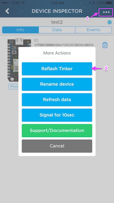
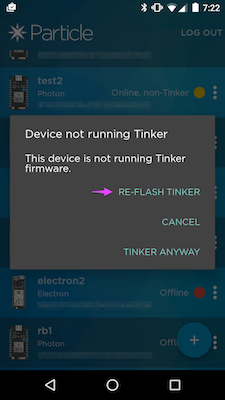

# Restoring Tinker

The Tinker firmware is installed on Photon and Electron devices in the factory and allows you control the pins from the phone apps and from the cloud easily. While the intention is that you will replace it with your own firmware that you write, sometimes you may want to get it back. Fortunately, it's easy to do so!

## iOS phone app

Using the iOS iPhone/iPad Particle app, select the device you want to reprogram.

Then click the **...** in the upper right corner (1) and click the **Reflash Tinker** button (2). 




## Android phone app

Using the Android Particle app, select the device you want to reprogram. If it's not already running Tinker, you'll be presented with the option to **Reflash Tinker** right away.



## Particle CLI

Installing the [Particle CLI](https://docs.particle.io/guide/tools-and-features/cli/photon/) is good idea because you will eventually find it useful as you develop with your Photon or Electron.

If you have it installed, put the device in DFU mode (blinking yellow) by holding down the SETUP and RESET buttons. Release RESET and continue to hold down SETUP while the main status LED blinks magenta, until it blinks yellow, then release SETUP.

(If you're using an Electron or Core, the button is labeled MODE, not SETUP, but it functions in the same way.)

Then enter the CLI command:

```
particle flash --usb tinker
```

If you get an error that dfu-util is not installed, you can either [install DFU util](https://github.com/rickkas7/particle_notes/tree/master/installing-dfu-util) or follow these alternate instructions:

Press and release RESET. Then hold down SETUP (or MODE) until the main status LED blinks dark blue. Then issue the command:

```
particle flash --serial tinker
```

The --usb option is preferable, unless you are having trouble with your DFU installation.

## By flashing it manually

You can also just copy and paste Tinker into your build environment and flash it to your device. Here's the source:

```
/* Function prototypes -------------------------------------------------------*/
int tinkerDigitalRead(String pin);
int tinkerDigitalWrite(String command);
int tinkerAnalogRead(String pin);
int tinkerAnalogWrite(String command);

SYSTEM_MODE(AUTOMATIC);

/* This function is called once at start up ----------------------------------*/
void setup()
{
    //Setup the Tinker application here

    //Register all the Tinker functions
    Particle.function("digitalread", tinkerDigitalRead);
    Particle.function("digitalwrite", tinkerDigitalWrite);

    Particle.function("analogread", tinkerAnalogRead);
    Particle.function("analogwrite", tinkerAnalogWrite);
}

/* This function loops forever --------------------------------------------*/
void loop()
{
    //This will run in a loop
}

/*******************************************************************************
 * Function Name  : tinkerDigitalRead
 * Description    : Reads the digital value of a given pin
 * Input          : Pin
 * Output         : None.
 * Return         : Value of the pin (0 or 1) in INT type
                    Returns a negative number on failure
 *******************************************************************************/
int tinkerDigitalRead(String pin)
{
    //convert ascii to integer
    int pinNumber = pin.charAt(1) - '0';
    //Sanity check to see if the pin numbers are within limits
    if (pinNumber < 0 || pinNumber > 7) return -1;

    if(pin.startsWith("D"))
    {
        pinMode(pinNumber, INPUT_PULLDOWN);
        return digitalRead(pinNumber);
    }
    else if (pin.startsWith("A"))
    {
        pinMode(pinNumber+10, INPUT_PULLDOWN);
        return digitalRead(pinNumber+10);
    }
#if Wiring_Cellular
    else if (pin.startsWith("B"))
    {
        if (pinNumber > 5) return -3;
        pinMode(pinNumber+24, INPUT_PULLDOWN);
        return digitalRead(pinNumber+24);
    }
    else if (pin.startsWith("C"))
    {
        if (pinNumber > 5) return -4;
        pinMode(pinNumber+30, INPUT_PULLDOWN);
        return digitalRead(pinNumber+30);
    }
#endif
    return -2;
}

/*******************************************************************************
 * Function Name  : tinkerDigitalWrite
 * Description    : Sets the specified pin HIGH or LOW
 * Input          : Pin and value
 * Output         : None.
 * Return         : 1 on success and a negative number on failure
 *******************************************************************************/
int tinkerDigitalWrite(String command)
{
    bool value = 0;
    //convert ascii to integer
    int pinNumber = command.charAt(1) - '0';
    //Sanity check to see if the pin numbers are within limits
    if (pinNumber < 0 || pinNumber > 7) return -1;

    if(command.substring(3,7) == "HIGH") value = 1;
    else if(command.substring(3,6) == "LOW") value = 0;
    else return -2;

    if(command.startsWith("D"))
    {
        pinMode(pinNumber, OUTPUT);
        digitalWrite(pinNumber, value);
        return 1;
    }
    else if(command.startsWith("A"))
    {
        pinMode(pinNumber+10, OUTPUT);
        digitalWrite(pinNumber+10, value);
        return 1;
    }
#if Wiring_Cellular
    else if(command.startsWith("B"))
    {
        if (pinNumber > 5) return -4;
        pinMode(pinNumber+24, OUTPUT);
        digitalWrite(pinNumber+24, value);
        return 1;
    }
    else if(command.startsWith("C"))
    {
        if (pinNumber > 5) return -5;
        pinMode(pinNumber+30, OUTPUT);
        digitalWrite(pinNumber+30, value);
        return 1;
    }
#endif
    else return -3;
}

/*******************************************************************************
 * Function Name  : tinkerAnalogRead
 * Description    : Reads the analog value of a pin
 * Input          : Pin
 * Output         : None.
 * Return         : Returns the analog value in INT type (0 to 4095)
                    Returns a negative number on failure
 *******************************************************************************/
int tinkerAnalogRead(String pin)
{
    //convert ascii to integer
    int pinNumber = pin.charAt(1) - '0';
    //Sanity check to see if the pin numbers are within limits
    if (pinNumber < 0 || pinNumber > 7) return -1;

    if(pin.startsWith("D"))
    {
        return -3;
    }
    else if (pin.startsWith("A"))
    {
        return analogRead(pinNumber+10);
    }
#if Wiring_Cellular
    else if (pin.startsWith("B"))
    {
        if (pinNumber < 2 || pinNumber > 5) return -3;
        return analogRead(pinNumber+24);
    }
#endif
    return -2;
}

/*******************************************************************************
 * Function Name  : tinkerAnalogWrite
 * Description    : Writes an analog value (PWM) to the specified pin
 * Input          : Pin and Value (0 to 255)
 * Output         : None.
 * Return         : 1 on success and a negative number on failure
 *******************************************************************************/
int tinkerAnalogWrite(String command)
{
    String value = command.substring(3);

    if(command.substring(0,2) == "TX")
    {
        pinMode(TX, OUTPUT);
        analogWrite(TX, value.toInt());
        return 1;
    }
    else if(command.substring(0,2) == "RX")
    {
        pinMode(RX, OUTPUT);
        analogWrite(RX, value.toInt());
        return 1;
    }

    //convert ascii to integer
    int pinNumber = command.charAt(1) - '0';
    //Sanity check to see if the pin numbers are within limits

    if (pinNumber < 0 || pinNumber > 7) return -1;

    if(command.startsWith("D"))
    {
        pinMode(pinNumber, OUTPUT);
        analogWrite(pinNumber, value.toInt());
        return 1;
    }
    else if(command.startsWith("A"))
    {
        pinMode(pinNumber+10, OUTPUT);
        analogWrite(pinNumber+10, value.toInt());
        return 1;
    }
    else if(command.substring(0,2) == "TX")
    {
        pinMode(TX, OUTPUT);
        analogWrite(TX, value.toInt());
        return 1;
    }
    else if(command.substring(0,2) == "RX")
    {
        pinMode(RX, OUTPUT);
        analogWrite(RX, value.toInt());
        return 1;
    }
#if Wiring_Cellular
    else if (command.startsWith("B"))
    {
        if (pinNumber > 3) return -3;
        pinMode(pinNumber+24, OUTPUT);
        analogWrite(pinNumber+24, value.toInt());
        return 1;
    }
    else if (command.startsWith("C"))
    {
        if (pinNumber < 4 || pinNumber > 5) return -4;
        pinMode(pinNumber+30, OUTPUT);
        analogWrite(pinNumber+30, value.toInt());
        return 1;
    }
#endif
    else return -2;
}
```
