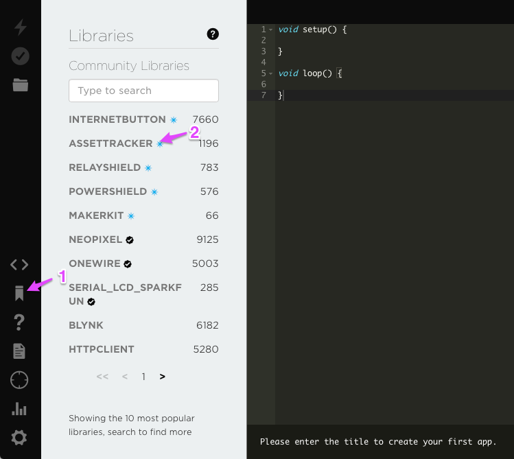
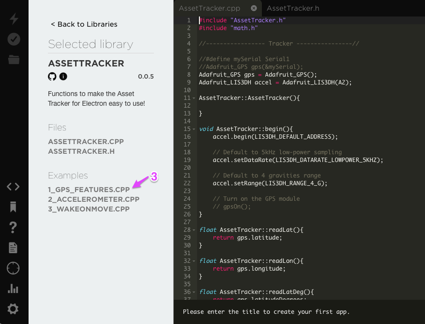
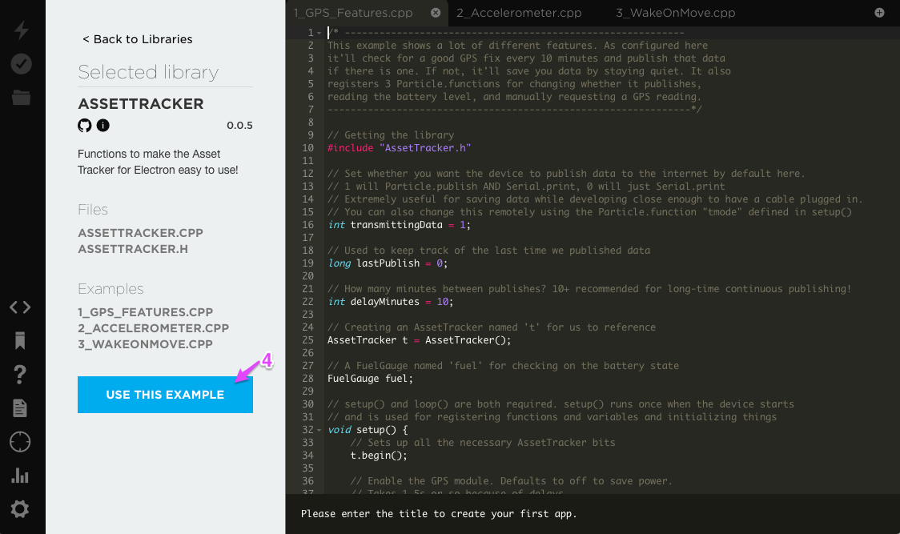
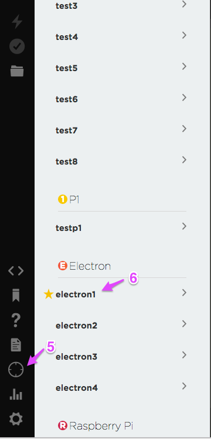

# Setting up AssetTracker in Build

- Click the **Libraries** icon (1) 
- Select **ASSETTRACKER** (2)

- Select **1\_GPS\_FEATURES.CPP** (3)

- Select **USE THIS EXAMPLE** (4)

- Click the Devices icon, the circle with 4 lines (5)
- Make sure your Electron has a gold star to the left of it. If not, click  the name.
- Click the <> icon to go back to your code.

- Click the **Verify** button to test the code

