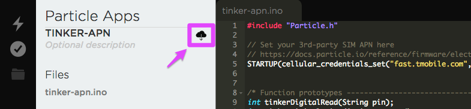

# Tinker with APN tips for Electron

Every firmware binary you run on your Electron with a 3rd-party SIM card must have the lines of code that set the APN and typically the keep-alive value. This is explained in detail in the [3rd-party SIM guide](https://docs.particle.io/faq/particle-devices/electron-3rdparty-sims/electron/) however this note is for help with flashing your first APN setting code.

The default firmware on the Electron from the factory is Tinker, and allows to do simple thing like change the state of the pins from the mobile apps. The caveat is that it does not work with 3rd-party SIM cards. You can fix this by flashing Tinker with APN firmware.

## Getting Started

If you have not done so already, please install the Particle CLI. The command line utilities are useful not only for solving this problem but will be valuable later on, as well.

[https://docs.particle.io/guide/tools-and-features/cli](https://docs.particle.io/guide/tools-and-features/cli)

If you are using Windows, be sure to use the link to [Windows CLI Installer](https://binaries.particle.io/cli/installer/windows/ParticleCLISetup.exe) that will automatically install all of the components instead of the more complicated manual install.


## Method 1: setup.particle.io

Once way to get a Tinker with APN binary is to go through the setup process at [https://setup.particle.io](https://setup.particle.io). Select the left option (Electron with SIM card) and enter the ICCID of your 3rd-party SIM card. You should be directed to the non-Particle SIM card page:


Follow the instructions on the page to flash your Electron with Tinker with APN setting.

## Method 2: Particle Build (Web IDE)

You can build your own version of Tinker with APN setting using Particle Build (Web IDE). This is handy because it allows you to tweak more settings.

- You can use [this link](https://go.particle.io/shared_apps/595d351dd3deccba2100013c) to open a shared version of the Tinker with APN app.

Or, if you prefer, you can open [tinker-apn.cpp](https://raw.githubusercontent.com/rickkas7/particle_notes/master/tinker-apn-tips/tinker-apn.cpp) and copy and paste it into a new app.

- Edit line 5 that begins with `STARTUP` to set the APN for your cellular provider. The example has fast.t-mobile.com; replace that with your APN.

```
STARTUP(cellular_credentials_set("fast.tmobile.com", "", "", NULL));
```

- Line 21 has a call to `Particle.keepAlive`. The keep-alive is explained in the [3rd-party SIM guide](https://docs.particle.io/faq/particle-devices/electron-3rdparty-sims/electron/). If you have not upgraded your Electron system firmware, you should comment out this line or you will get a compile error.

```
Particle.keepAlive(120);
```

- Or, even better, upgrade your Electron. Hold down RESET and MODE, release RESET and continue to hold down MODE while the status LED blinks magenta until it blinks yellow, then release MODE. Then enter the command in a Command Prompt (for Windows) or Terminal (for Mac or Linux) window:

```
particle update
```

- Click on the Devices icon (circle with 4 lines) and make sure your Electron is selected.

- Click on the Code icon (<>). Then click on the cloud icon to the right of the project name.



This will download the firmware to your Internet Downloads directory.

- Hold down RESET and MODE, release RESET and continue to hold down MODE while the status LED blinks magenta until it blinks yellow, then release MODE. Then enter the command in a Command Prompt (for Windows) or Terminal (for Mac or Linux) window:

```
cd Downloads
particle flash --usb firmware.bin
```

If you've downloaded firmware before, the name may be different. If it contains spaces, enclose the name in double quotes, like this:

```
particle flash --usb "firmware (1).bin"
```

- If you get an error that dfu-util is not found, you should [install it](https://docs.particle.io/faq/particle-tools/installing-dfu-util/electron/). However you can use the alternate method of installation until you do: Reset the Electron. Then hold down the MODE button until the status LED blinks dark blue. Then issue the command:

```
particle flash --serial firmware.bin
```


## Method 3: Particle CLI

- Download the [tinker-apn.cpp](https://raw.githubusercontent.com/rickkas7/particle_notes/master/tinker-apn-tips/tinker-apn.cpp) file.

- Hold down RESET and MODE, release RESET and continue to hold down MODE while the status LED blinks magenta until it blinks yellow, then release MODE. 

- If you have not upgraded your Electron system firmware from the factory default, you should do so by doing:

```
particle update
```

- Edit line 5 of tinker-apn.cpp that begins with `STARTUP` to set the APN for your cellular provider. The example has fast.t-mobile.com; replace that with your APN.

- Line 21 has a call to `Particle.keepAlive`. The keep-alive is explained in the [3rd-party SIM guide](https://docs.particle.io/faq/particle-devices/electron-3rdparty-sims/electron/). If you have not upgraded your Electron system firmware, you should comment out this line or you will get a compile error.

- Then build and flash Tinker with APN. Make sure the Electron is blinking yellow before you use the flash command.

```
cd Downloads
particle compile electron tinker-apn.cpp --saveTo tinker-apn.bin
particle flash --usb tinker-apn.bin
```

- If you get an error that dfu-util is not found, you should [install it](https://docs.particle.io/faq/particle-tools/installing-dfu-util/electron/). However you can use the alternate method of installation until you do: Reset the Electron. Then hold down the MODE button until the status LED blinks dark blue. Then issue the command:

```
particle flash --serial tinker-apn.bin
```

- If you don't want to upgrade your Electron system firmware, you must target the the earlier version, for example:

```
particle compile electron tinker-apn.cpp --target 0.4.8 --saveTo tinker-apn.bin
```

