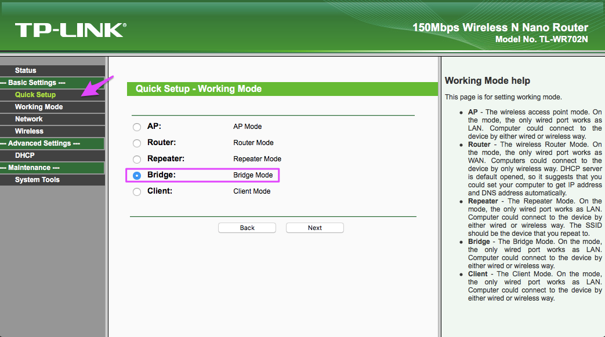
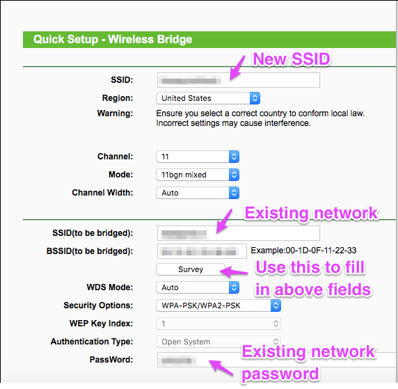
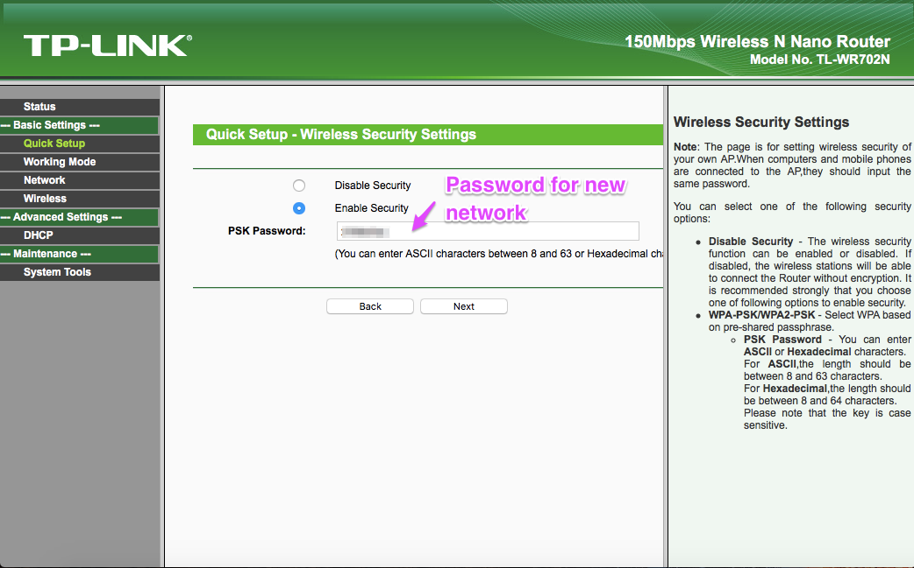

# Using a TP-LINK Mini Router

I like the TP-LINK N150 TL-WR702N mini-router. It's been replaced by the newer N300, which should be similar. It's tiny, can be powered by USB, and is under US$30. 

This note discusses using it on a wireless network where you need to agree to terms of service in a web page before getting access to the network (captive portal), like commonly occurs in hotels. The Photon doesn't work directly with those types of networks, but the TP-LINK router often does and can act as an intermediary.

You'll need to connect your laptop to the TP-LINK router. You can do this either using Ethernet or Wi-Fi:

## Connecting by Ethernet 

- Plug in the router power
- Connect it by Ethernet to your laptop.
- Go into your network settings. Disable Wi-Fi. Enable Ethernet if necessary.
- Select manual configuration, IP Address 192.168.0.100, Subnet Mask 255.255.255.0, Router 192.168.0.254.
- Go to the web page: http://192.168.0.254
- Log in with the default username and password, "admin" for both.


## Connecting by Wi-Fi

- Plug in the router power
- Select the TP-LINK Wi-Fi SSID on your laptop. It's printed on a label on the router.
- Enter the password. It's printed in microscopic print on a label on the router.
- Go to the web page: http://tplinklogin.net
- Log in with the default username and password, "admin" for both.

## Configure the router

The easiest way is to use **Quick Setup**. You probably will want **Bridge** mode.



The top block is the new network information, the one that your Photon and laptop will eventually connect to.

The bottom block is the network your are connecting to, the one that has access to the Internet, such as the hotel network. Use the **Survey** button to select the network to connect to. This will fill in the SSID and BSSID fields for you.

The password field at the bottom is the password for the network you are connecting to, such as a hotel network.



In the last page you enter the security information for the Wi-Fi network that you created. The SSID is the top one in the previous page, and the password is here.



## Accept any terms of service

If your laptop is connected by Ethernet you can leave it connected that way, or you can switch to Wi-Fi now.

You must select the new Wi-Fi network you just created on your laptop. 

If you need to agree to terms of service, go to any web page now and you'll be redirected and can accept the terms of service. Make sure it's OK for you to add a router to their network.

Once that's done and you can access the Internet through the TP-LINK router from your laptop, you can set up your Photon.

## Set up Photon

You can now use whatever technique you like to set up your Photon. I prefer to use the CLI command:

```
particle serial wifi
```

This command does not change your device claiming and only resets the Wi-Fi network SSID and password.

Make sure your Photon is in listening mode (blinking blue) before issuing the command. Hold down SETUP until it blinks blue.

And of course enter the information for the new SSID and password you just created.
