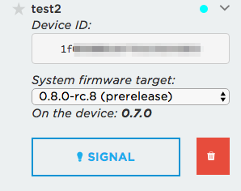
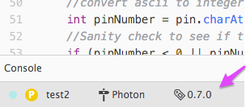

# Upgrading and downgrading Particle Device OS

More information than you ever wanted to know about upgrading and downgrading Particle Device OS (system firmware).

## Automatic updates

In many cases, system firmware updates occur automatically; you don't need to do anything special. The Safe Mode Healer takes care of doing the update for you.

### Web IDE (Particle build)

In Particle [Web IDE](https://build.particle.io), click on the Devices icon (circle with 4 lines), and open up the device by clicking on the > and then change the system firmware target to the appropriate version:



In this example, the device has 0.7.0, and it will be upgraded to 0.8.0-rc.8.

Your firmware is flashed to the device over-the-air, and if it requires a newer system firmware version, the device will blink magenta while the system firmware upgrades. It will reboot a few times.

Note that this is the minimum system version. If, for example, you have 0.7.0 installed and subsequently flash firmware that requires system firmware 0.6.3, the device will not be downgraded. However, a binary that requires 0.6.3 can still run on 0.7.0 so it will still work properly.

### Particle Dev (Atom IDE)

At the bottom of the Particle Dev screen, click on the version number to change to a different version.



### Particle CLI

In the CLI, you use a command like:

```
particle compile photon project.ino --target 0.8.0-rc.8
```

That will build project.ino and target system firmware 0.8.0-rc.8.

The list of valid versions can be found at the [release site](https://github.com/particle-iot/firmware/tags).

### Automatic updates - Electron and E Series

Automatic updates work for the Electron and E series as well. However, because your data usage is metered, you may want to use USB instead. System firmware 0.7.0 is approximately 288 Kbytes. 

Whenever you upgrade from a version prior to 0.5.3, to a version after 0.5.3, there will always be an intermediate upgrade to 0.5.3. For example, if you upgrade from 0.4.8 (older factory default) to 0.6.2, there will be one upgrade to 0.5.3, then another to 0.6.2. The reason is that in 0.6.0 Electron system firmware changed from 2 to 3 parts. The intermediate upgrade is necessary as 0.5.3 has 2 parts, but knows how to install 3 parts. This happens automatically, but will use nearly twice the data and take twice as long, so that's something to keep in mind.

Electrons ship with 0.5.3 now, so the second update is not necessary.

### Automatic updates - Spark Core

The older Spark Core uses monolithic firmware. Each firmware binary contains both the system firmware and the user firmware. This there is no need to update the system firmware as every firmware binary contains the appropriate system firmware as well.

This isn't done on the Photon because a user firmware that's 10 Kbytes on the Photon might be 480 Kbytes on the Spark Core, and it takes way longer to download the larger binaries. 

## Particle CLI (recommended)

The fastest and most reliable way to update system firmware is using the [Particle CLI](https://docs.particle.io/guide/tools-and-features/cli). 

Connect the device by USB and put the device in [DFU mode](https://docs.particle.io/guide/getting-started/modes/#dfu-mode-device-firmware-upgrade-) (blinking yellow) by holding down RESET and SETUP (or MODE), releasing RESET and continuing to hold down SETUP (or MODE) while the main LED blinks magenta until it blinks yellow, then release. 

Then enter this command in a Command Prompt or Terminal window:

```
particle update
```

Note that the CLI does not automatically update to the latest system firmware version, it updates to the version associated with that version of the CLI. 

For example, if you have CLI version 1.17.0 installed, you get system firmware 0.5.3, not the latest version.

To update the Particle CLI installed by the installer, use:

```
particle update-cli
```

### dfu-util not found

The dfu-util program should be installed by the Particle CLI installer. If you get an error that it's not found [the instructions are here](https://docs.particle.io/faq/particle-tools/installing-dfu-util/) may be helpful in fixing the problem.

### Exception: Windows 7 64-bit and DFU mode

The Particle CLI system firmware update uses the DFU mode (blinking yellow). DFU requires a device driver under Windows, and the device driver does not work on Windows 7 64-bit. It works on Windows 7 32-bit, and Windows 8 and later 32-bit and 64-bit, just not Windows 7 64-bit.

As it may be useful to be able to use DFU for other reasons, you may want to find another computer you can use for this purpose.

You can the instructions for manual upgrades using USB and CLI, below, however.

### Firmware Manager

The Firmware Manager for Windows and Mac OS is no longer supported. It can be used to upgrade only to 0.6.0, it is not built for later versions.


## Manual upgrades and downgrades

The first step is to download the binaries. Go the the [release site](https://github.com/particle-iot/firmware/tags) and pick the version you want to use, then click the Download link next to the cloud icon.

Download the necessary parts:

- For Photon: system-part1-xxx-photon.bin, system-part2-xxx-photon.bin
- For P1: system-part1-xxx-p1, system-part2-xxx-p1.bin
- For Electron/E Series: system-part1-xxx-electron.bin, system-part2-xxx-electron.bin, system-part3-xxx-electron.bin

If you are upgrading from a version before 0.7.0 to 0.7.0 or later, you may also want to download the bootloader file.

### Manual over-the-air (OTA) upgrades using the CLI

The easiest way to do a manual OTA upgrade (or downgrade, below) is using the Particle CLI. 

When doing this process, you need to wait for the device to reboot after each step. If the device is not in front of you, the best way to monitor this is to open [the console](http://console.particle.io) Events tab, and watch for the online events.

Also, there is a good possibility that after you flash system part 1, the safe mode healer will take over and finish the remainder of the parts automatically for you.

For example, to flash system part 1 of 0.7.0 for Photon OTA, you'd use a command like:

```
particle flash DEVICE_NAME system-part1-0.7.0-photon.bin
```

Replace DEVICE\_NAME with the name of your device, of course.

Repeat this process for the other system parts if necessary.

### Manual over-the-air (OTA) downgrades using the CLI

It is possible to do a downgrade of system firmware OTA. There may be additional caveats based on the system version, so be sure to check the release notes for the version you are downgrading from and the Downgrade Chart, below, for more information.

**The important thing is that you must flash the parts in the reverse order, for example: 2 then 1 for Photon or 3, then 2, then 1 for Electron.**

When doing this process, you need to wait for the device to reboot after each step. If the device is not in front of you, the best way to monitor this is to open [the console](http://console.particle.io) Events tab, and watch for the online events.

Make sure you flash user firmware that requires only the earlier system firmware version before downgrading the system firmware. Otherwise your downgrade will be immediately followed by a safe mode healer upgrade!

Also note that for example you can run a binary that targets 0.5.3 on a device that is running 0.6.2. This is fully supported and you don't have to downgrade the system firmware version.

### Electron 0.4.8 OTA upgrade warning

Whenever you upgrade from a version prior to 0.5.3, to a version after 0.5.3, you must always do an intermediate upgrade through 0.5.3. For example, if you upgrade from 0.4.8 (factory default) to 0.6.2, you need to upgrade first to 0.5.3, then upgrade again 0.6.2. 

The reason is that in 0.6.0 Electron system firmware changed from 2 to 3 parts. The intermediate upgrade is necessary as 0.5.3 has 2 parts, but knows how to install 3 parts. 

The Safe Mode Healer knows how to do this, but if you upgrade OTA manually you need to do the intermediate upgrade yourself.

### Manual OTA updates of product devices

The particle flash command cannot be used with product devices. You'll need to write a simple script or use a curl command directly to flash a product device.

- You'll need an access token for your product. The easiest way to get one is to open [the console](https://console.particle.io), your product, Events, then click view in console. It will print an access token which looks something like 970cead6d403b6e7af4ab43ab1358b599fa94082.
- Be sure to change 1234 to your actual numeric product ID, which is displayed next to the key icon in the console.
- And substitute the actual device ID for 0468136beae1556af72d3230.

```
curl -X PUT "https://api.particle.io/v1/products/1234/devices/0468136beae1556af72d3230?access_token=970cead6d403b6e7af4ab43ab1358b599fa94082" \
       -F file=@system-part1-0.7.0-electron.bin \
       -F file_type=binary
```

### Using USB DFU mode (blinking yellow)

USB DFU mode (blinking yellow) is the most reliable way to upgrade or downgrade system firmware.

Hold down RESET and SETUP (or MODE) at the same time. Release RESET and continue to hold down SETUP (or MODE) while the status LED blinks magenta (red and blue at the same time) until it blinks yellow, then release.

For example, to flash system part 1 of 0.7.0 for Photon by USB serial, you'd use a command like:

```
particle flash --usb system-part1-0.7.0-photon.bin
```

You cannot flash the bootloader file in --usb mode. See --serial, below.

### Using USB serial mode (listening mode)

Whenever possible you should use DFU mode, but if you are using Windows 7 64-bit, or other situations where DFU mode is not working, you can use listening mode (blinking dark blue). This mode is also necessary for flashing the bootloader by USB.

Hold down the SETUP (or MODE) button until the status LED blinks dark blue.

For example, to flash system part 1 of 0.7.0 for Photon by USB serial in listening mode you'd use a command like:

```
particle flash --serial system-part1-0.7.0-photon.bin
```

The bootloader can only be flashed OTA or in listening mode. The bootloader cannot be flashed in DFU mode.

```
particle flash --serial bootloader-0.7.0-photon.bin
```

## Upgrade and downgrade chart

### Upgrade Chart - Photon/P1

- You should be able to upgrade any 0.4.6 or later directly to any version for Photon/P1. 

There is one important caveat, however: If you are upgrading from a version prior to 0.7.0 to 0.7.0 or later, on the Photon/P1 the device must have cloud access unless you flash the bootloader manually. 

The reason is that 0.7.0 requires a bootloader upgrade. In versions prior to 0.7.0 the bootloader was embedded in the system firmware parts, but there wasn't enough room in 0.7.0 to do that. 

If you're upgrading OTA (including safe mode healer), you'll notice four reboots or more, for user part, for system part 1, system part 2, and bootloader.

The bootloader should be updated by safe mode healer, unless you have a device that is not configured for Wi-Fi, then you should manually flash the bootloader in serial mode or JTAG/SWD. The bootloader cannot be flashed in DFU mode.

The particle update command knows how to flash both the system parts and bootloader in one step.

Photons running monolithic firmware (built using the local gcc-arm build chain, or prior to 0.4.1) can only be switched to normal modular firmware by USB. They cannot be upgraded OTA.

### Downgrade Chart - Photon/P1

- Any version 0.7.0 or later to 0.6.x, you must downgrade to 0.6.3 first. (Reason: only this version downgrades the bootloader.) After you downgrade to 0.6.3 you can downgrade further if necessary. OTA you must flash part2, then part 1.

- Any version 0.7.0 or later to 0.5.x, you must downgrade to 0.5.5 first. (Reason: only this version downgrades the bootloader.) After you downgrade to 0.5.5 you can downgrade further if necessary. OTA you must flash part2, then part 1.

### Upgrade Chart - Electron

Any version prior to 0.5.3, including the old factory default of 0.4.8, you must upgrade to 0.5.3, 0.5.4, or 0.5.5 before upgrading to any higher version. (Reason: support for 3 system parts.)

### Downgrade Chart - Electron

- Any version 0.7.0 or later to 0.6.x, you must downgrade to 0.6.4 first. (Reason: only this version downgrades the bootloader.) After you downgrade to 0.6.4 you can downgrade further if necessary. OTA you must flash part3, part2, then part 1.

- Any version 0.7.0 or later to 0.5.x, you must downgrade to 0.5.5 first. (Reason: only this version downgrades the bootloader, and downgrade to 2 system parts). OTA you must flash part 2, then part 1.

- 0.6.x to 0.5.2 or earlier: You must downgrade to 0.5.3, 0.5.4, or 0.5.5 first. (Reason: downgrade to 2 system parts). OTA you must flash part2, then part 1.


## I'm stuck in safe mode

If you're not sure why you're stuck in safe mode, it's best to use the `particle serial inspect` command. The device must be connected by USB and in listening mode (blinking dark blue). Hold down the SETUP or MODE button to enter listening mode.

```
$ particle serial inspect
Platform: 6 - Photon
Modules
  Bootloader module #0 - version 101, main location, 16384 bytes max size
    Integrity: PASS
    Address Range: PASS
    Platform: PASS
    Dependencies: PASS
  System module #1 - version 207, main location, 262144 bytes max size
    Integrity: PASS
    Address Range: PASS
    Platform: PASS
    Dependencies: PASS
  System module #2 - version 207, main location, 262144 bytes max size
    Integrity: PASS
    Address Range: PASS
    Platform: PASS
    Dependencies: PASS
      System module #1 - version 207
      Bootloader module #0 - version 7
  User module #1 - version 2, main location, 131072 bytes max size
    UUID: 2BA4E71E840F596B812003882AAE7CA6496F1590CA4A049310AF76EAF11C943A
    Integrity: PASS
    Address Range: PASS
    Platform: PASS
    Dependencies: PASS
      System module #2 - version 1
  empty - factory location, 131072 bytes max size
```

The main thing you need is is the semantic version (207) to system version (0.7.0) [mapping table](https://github.com/particle-iot/firmware/blob/develop/system/system-versions.md).

That table also lists the bootloader required for each system version, which is helpful.

The output above is normal for 0.7.0, system version and bootloader version are correct, which is why everything passes.

User module is always version 4, that’s an internal version number, not related to PRODUCT_VERSION for product firmware. The factory location is always empty on a Photon.

Integrity is the check of the CRC included in every firmware binary.


## SD Card

It's possible to upgrade system firmware via SD card, if you've added the appropriate hardware and software. There is a [proof-of-concept project](https://github.com/rickkas7/sdfirmwareflash) that does that.


