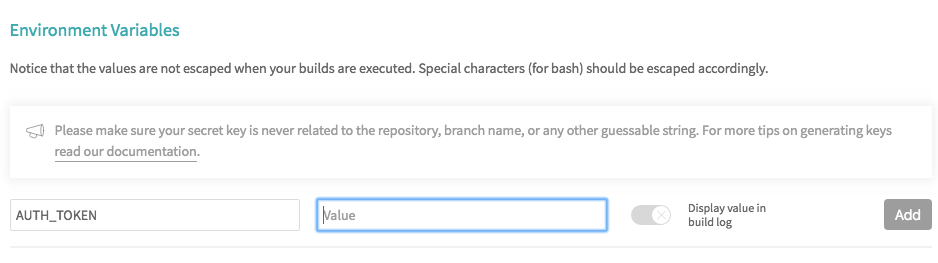

# Using Travis CI with Particle Libraries

[Travis CI](https://travis-ci.org) (continuous integration) is a great tool for validating your Particle libraries after you've made changes and committed them to Github.

You can automatically link your Github and Travis CI accounts so a build starts immediately after committing to master or a branch.

## Getting a Particle Access Token

For security reasons, you may want to create a separate Particle account that you use only for compiling. It doesn't need to have any devices in it. 

You can just another email address if you have one, or if you use Google Mail, you can the a plus email. For example, if your Google email address is johnsmith@gmail.com, you can sign up for a Particle account at johnsmith+travis@gmail.com and you'll have two separate Particle accounts, but the email will still go to your regular gmail account.

Log into [build.particle.io](https://build.particle.io) and go to Settings, the gear icon (1) and copy the Access Token (2).


You may prefer to use curl, which will allow you to create an access token that does not expire using the [generate access token API](https://docs.particle.io/reference/api/#generate-an-access-token).

```
curl https://api.particle.io/oauth/token \
       -u particle:particle \
       -d grant_type=password \
       -d "username=joe@example.com" \
       -d "password=SuperSecret" \
       -d "expires_in=0"
```


## Enabling Travis

Create a [Travis CI](https://travis-ci.org) account if you don't have one already and connect it to your Github account. The [Getting started guide](https://docs.travis-ci.com/user/getting-started/) will help.

In the settings for your repository, add an **Environment Variable**.

The name of the variable must be `AUTH_TOKEN` and the value is what you copied from build. 



Once you've pasted it in, it won't be displayed again, so it's relatively secure. Also make sure the Display value in build log is not enabled, which will makes sure it's not displayed in the public build log!


## Updating your project

You'll need a `.travis.yml` file in the top level of your Github repository, typically where your library.properties file is:

```
language: node_js
node_js: lts/carbon
```

You'll also need a `package.json` file. Change the name to match your project, but it doesn't really matter. It's only there so Travis knows what dependencies to load.

```
{
    "name": "DS2482-RK",
    "version": "0.0.1",
    "description": "Travis build script",
    "private": true,
    "scripts": {
        "test": "node node_modules/@rickkas7/particle-builder/particle-builder.js ."
    },
    "author": "rickkas7@github.com",
    "contributors": [
    ],
    "license": "Apache Version 2.0",
    "dependencies": {
        "@rickkas7/particle-builder": "^0.0.2"
    },
    "engines": {
        "node": ">=4.3.2"
    }
}
```

Finally, you'll need a build.yml file. This is for the particle-builder tool and describes which platforms, versions, and examples to build.

Here's a simple build.yml:

```
- build: examples/1-simple-SpiffsParticleRK
  photon: [0.7.0]
  p1: [latest]
```

This builds the example 1 for the Photon (system firmware 0.7.0) and the p1 (latest release version).

Or, a more complicated example:

```
- build: examples/1-simple-SpiffsParticleRK
  photon: [0.6.3, 0.7.0, 0.8.0-rc.8]
  p1: [latest]
  electron: [latest]
- build: examples/2-self-test-SpiffsParticleRK
  photon: [latest]
- build: examples/3-stop-sleep-SpiffsParticleRK
  photon: [latest]
- build: examples/4-deep-sleep--SpiffsParticleRK
  photon: [latest]
- build: examples/5-benchmark-SpiffsParticleRK
  photon: [latest]
```

Unlike the default in Travis, this does not default to creating an n x n matrix, as in most cases this just results in a very large number of unnecessary builds. For example, the differences between the Photon and P1 are minimal, so the test coverage of the P1 is reduced in the example above.

When you look at the output from Travis, you'll see the build output for each one of the platforms and directories specified in the build.yml file, like this:

```
Compiling code for photon
Targeting version: 0.6.3
Including:
    examples/1-simple-SpiffsParticleRK/1-simple-SpiffsParticleRK.cpp
    library.properties
    src/SpiffsParticleRK.cpp
    src/SpiffsParticleRK.h
    src/spiffs.h
    src/spiffs_cache.c
    src/spiffs_check.c
    src/spiffs_config.h
    src/spiffs_gc.c
    src/spiffs_hydrogen.c
    src/spiffs_nucleus.c
    src/spiffs_nucleus.h
attempting to compile firmware 
downloading binary from: /v1/binaries/5b3b8a6d3fa1d974ee07ab06
saving to: firmware.bin
Memory use: 
   text	   data	    bss	    dec	    hex	filename
  39148	    120	   1836	  41104	   a090	/workspace/target/workspace.elf
Compile succeeded.
Saved firmware to: /home/travis/build/rickkas7/SpiffsParticleRK/firmware.bin
compile exited with code 0
```

If an error occurs, the Travis log will show the error and the build will stop with a failed Travis build.
